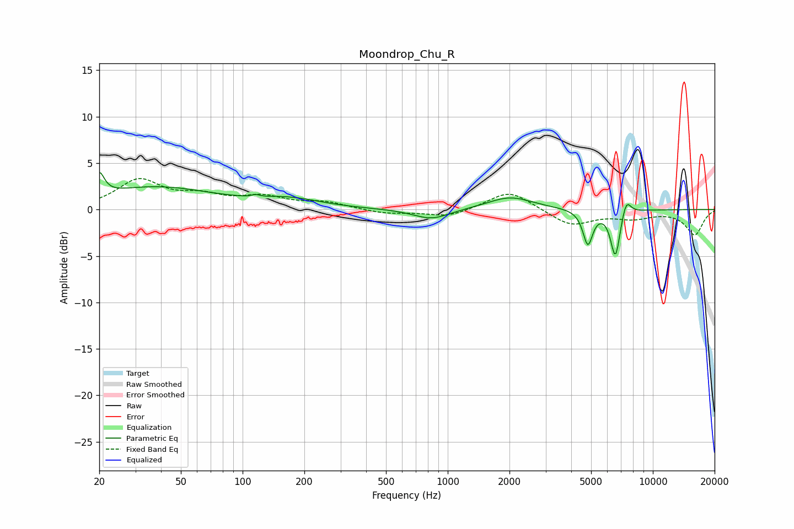

# Moondrop_Chu_R
See [usage instructions](https://github.com/jaakkopasanen/AutoEq#usage) for more options and info.

### Parametric EQs
Apply preamp of -4.1 dB when using parametric equalizer.

|   # | Type    |   Fc (Hz) |    Q |   Gain (dB) |
|-----|---------|-----------|------|-------------|
|   1 | Peaking |        20 | 5.93 |         2.4 |
|   2 | Peaking |        38 | 0.51 |         2.4 |
|   3 | Peaking |       115 | 5.24 |        -1.4 |
|   4 | Peaking |       115 | 5.64 |         1.6 |
|   5 | Peaking |       170 | 0.92 |         0.9 |
|   6 | Peaking |       833 | 1.59 |        -1.1 |
|   7 | Peaking |      2013 | 1.29 |         1.4 |
|   8 | Peaking |      4821 | 5.9  |        -3.7 |
|   9 | Peaking |      6568 | 5.85 |        -5.1 |
|  10 | Peaking |      7415 | 6    |         1.8 |

### Fixed Band EQs
When using fixed band (also called graphic) equalizer, apply preamp of **-3.4 dB** (if available) and set gains manually with these parameters.

|   # | Type    |   Fc (Hz) |    Q |   Gain (dB) |
|-----|---------|-----------|------|-------------|
|   1 | Peaking |        31 | 1.41 |         3.1 |
|   2 | Peaking |        62 | 1.41 |         1.2 |
|   3 | Peaking |       125 | 1.41 |         1.2 |
|   4 | Peaking |       250 | 1.41 |         0.7 |
|   5 | Peaking |       500 | 1.41 |        -0.4 |
|   6 | Peaking |      1000 | 1.41 |        -0.8 |
|   7 | Peaking |      2000 | 1.41 |         2.1 |
|   8 | Peaking |      4000 | 1.41 |        -1.7 |
|   9 | Peaking |      8000 | 1.41 |        -0.8 |
|  10 | Peaking |     16000 | 1.41 |        -2.7 |

### Graphs

