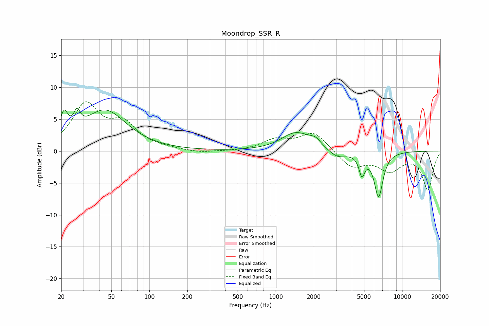

# Moondrop_SSR_R
See [usage instructions](https://github.com/jaakkopasanen/AutoEq#usage) for more options and info.

### Parametric EQs
Apply preamp of -6.8 dB when using parametric equalizer.

|   # | Type    |   Fc (Hz) |    Q |   Gain (dB) |
|-----|---------|-----------|------|-------------|
|   1 | Peaking |        21 | 4.5  |         3.9 |
|   2 | Peaking |        27 | 5.69 |         2.5 |
|   3 | Peaking |        44 | 0.83 |         6.3 |
|   4 | Peaking |      1422 | 1.28 |         2.7 |
|   5 | Peaking |      1788 | 1.95 |         0.2 |
|   6 | Peaking |      2005 | 1.5  |         0.2 |
|   7 | Peaking |      2076 | 3.29 |         0.9 |
|   8 | Peaking |      3079 | 1.93 |        -1.2 |
|   9 | Peaking |      4812 | 5.99 |        -3.1 |
|  10 | Peaking |      6520 | 3.9  |        -7   |

### Fixed Band EQs
When using fixed band (also called graphic) equalizer, apply preamp of **-7.8 dB** (if available) and set gains manually with these parameters.

|   # | Type    |   Fc (Hz) |    Q |   Gain (dB) |
|-----|---------|-----------|------|-------------|
|   1 | Peaking |        31 | 1.41 |         7   |
|   2 | Peaking |        62 | 1.41 |         3.7 |
|   3 | Peaking |       125 | 1.41 |         0.3 |
|   4 | Peaking |       250 | 1.41 |        -0.3 |
|   5 | Peaking |       500 | 1.41 |        -0.1 |
|   6 | Peaking |      1000 | 1.41 |         1.6 |
|   7 | Peaking |      2000 | 1.41 |         2.9 |
|   8 | Peaking |      4000 | 1.41 |        -2.5 |
|   9 | Peaking |      8000 | 1.41 |        -2.8 |
|  10 | Peaking |     16000 | 1.41 |        -6   |

### Graphs

