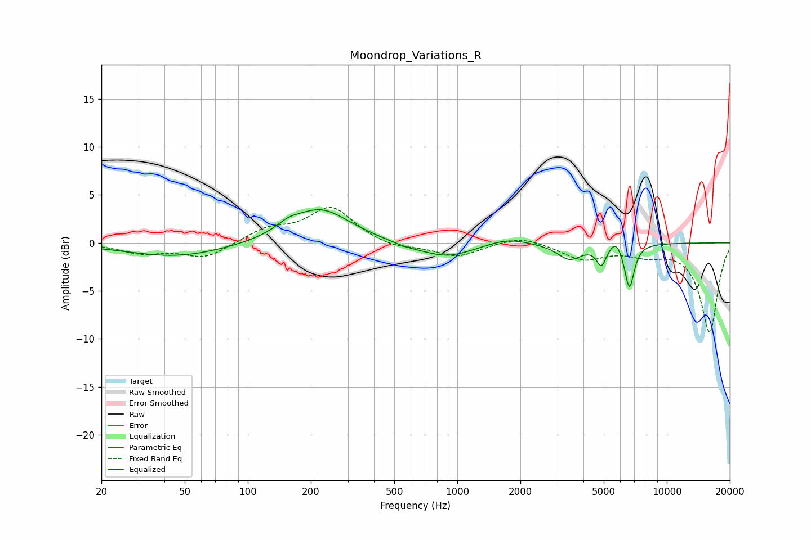

# Moondrop_Variations_R
See [usage instructions](https://github.com/jaakkopasanen/AutoEq#usage) for more options and info.

### Parametric EQs
Apply preamp of -3.5 dB when using parametric equalizer.

|   # | Type    |   Fc (Hz) |    Q |   Gain (dB) |
|-----|---------|-----------|------|-------------|
|   1 | Peaking |        46 | 0.6  |        -1.4 |
|   2 | Peaking |       155 | 2.63 |         0.7 |
|   3 | Peaking |       221 | 1    |         3.6 |
|   4 | Peaking |       564 | 1.9  |        -0.3 |
|   5 | Peaking |       889 | 1.13 |        -1.5 |
|   6 | Peaking |      1734 | 1.54 |         0.7 |
|   7 | Peaking |      3437 | 2.41 |        -1.7 |
|   8 | Peaking |      4873 | 6    |        -2   |
|   9 | Peaking |      5714 | 4.69 |         1.1 |
|  10 | Peaking |      6626 | 5.97 |        -4.7 |

### Fixed Band EQs
When using fixed band (also called graphic) equalizer, apply preamp of **-3.8 dB** (if available) and set gains manually with these parameters.

|   # | Type    |   Fc (Hz) |    Q |   Gain (dB) |
|-----|---------|-----------|------|-------------|
|   1 | Peaking |        31 | 1.41 |        -1   |
|   2 | Peaking |        62 | 1.41 |        -1.6 |
|   3 | Peaking |       125 | 1.41 |         1.4 |
|   4 | Peaking |       250 | 1.41 |         3.7 |
|   5 | Peaking |       500 | 1.41 |        -0.6 |
|   6 | Peaking |      1000 | 1.41 |        -1.4 |
|   7 | Peaking |      2000 | 1.41 |         0.8 |
|   8 | Peaking |      4000 | 1.41 |        -1.6 |
|   9 | Peaking |      8000 | 1.41 |        -1   |
|  10 | Peaking |     16000 | 1.41 |        -9.3 |

### Graphs

