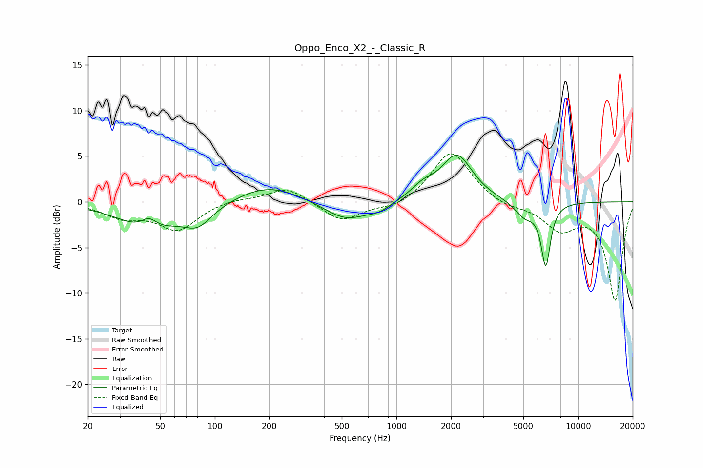

# Oppo_Enco_X2_-_Classic_R
See [usage instructions](https://github.com/jaakkopasanen/AutoEq#usage) for more options and info.

### Parametric EQs
Apply preamp of -5.2 dB when using parametric equalizer.

|   # | Type    |   Fc (Hz) |    Q |   Gain (dB) |
|-----|---------|-----------|------|-------------|
|   1 | Peaking |        43 | 3.14 |         1.4 |
|   2 | Peaking |        44 | 0.9  |        -3   |
|   3 | Peaking |        81 | 1.82 |        -2   |
|   4 | Peaking |       198 | 0.81 |         1.9 |
|   5 | Peaking |       527 | 1.16 |        -2.1 |
|   6 | Peaking |       802 | 2.1  |        -0.7 |
|   7 | Peaking |      1396 | 2.14 |         1.2 |
|   8 | Peaking |      2153 | 1.65 |         5   |
|   9 | Peaking |      5092 | 2.46 |        -1.7 |
|  10 | Peaking |      6644 | 5.3  |        -6.7 |

### Fixed Band EQs
When using fixed band (also called graphic) equalizer, apply preamp of **-5.4 dB** (if available) and set gains manually with these parameters.

|   # | Type    |   Fc (Hz) |    Q |   Gain (dB) |
|-----|---------|-----------|------|-------------|
|   1 | Peaking |        31 | 1.41 |        -1.5 |
|   2 | Peaking |        62 | 1.41 |        -3   |
|   3 | Peaking |       125 | 1.41 |         0.4 |
|   4 | Peaking |       250 | 1.41 |         1.7 |
|   5 | Peaking |       500 | 1.41 |        -2.2 |
|   6 | Peaking |      1000 | 1.41 |        -0.8 |
|   7 | Peaking |      2000 | 1.41 |         5.7 |
|   8 | Peaking |      4000 | 1.41 |        -0.6 |
|   9 | Peaking |      8000 | 1.41 |        -2.8 |
|  10 | Peaking |     16000 | 1.41 |       -10.7 |

### Graphs

