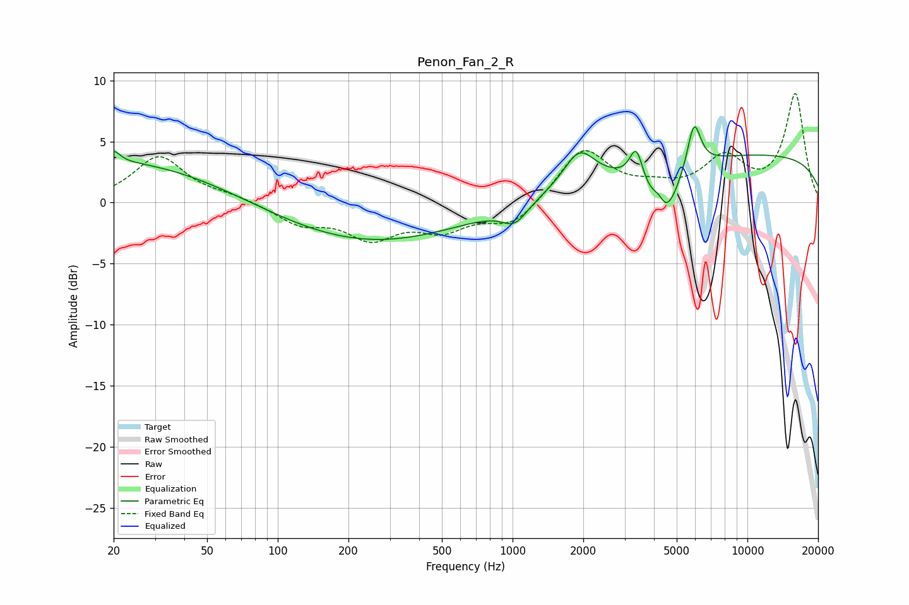

# Penon_Fan_2_R
See [usage instructions](https://github.com/jaakkopasanen/AutoEq#usage) for more options and info.

### Parametric EQs
Apply preamp of -6.3 dB when using parametric equalizer.

|   # | Type    |   Fc (Hz) |    Q |   Gain (dB) |
|-----|---------|-----------|------|-------------|
|   1 | Peaking |        20 | 5.34 |         0.9 |
|   2 | Peaking |        28 | 0.23 |         4   |
|   3 | Peaking |       181 | 0.29 |        -4   |
|   4 | Peaking |      1023 | 2.6  |        -1.6 |
|   5 | Peaking |      1921 | 2.12 |         2.9 |
|   6 | Peaking |      3363 | 5.16 |         2.8 |
|   7 | Peaking |      4196 | 4.75 |         1.9 |
|   8 | Peaking |      4360 | 2.28 |        -5.5 |
|   9 | Peaking |      5927 | 4.86 |         3.9 |
|  10 | Peaking |     10000 | 0.18 |         4   |

### Fixed Band EQs
When using fixed band (also called graphic) equalizer, apply preamp of **-9.0 dB** (if available) and set gains manually with these parameters.

|   # | Type    |   Fc (Hz) |    Q |   Gain (dB) |
|-----|---------|-----------|------|-------------|
|   1 | Peaking |        31 | 1.41 |         3.8 |
|   2 | Peaking |        62 | 1.41 |         0.5 |
|   3 | Peaking |       125 | 1.41 |        -1.6 |
|   4 | Peaking |       250 | 1.41 |        -2.6 |
|   5 | Peaking |       500 | 1.41 |        -1.9 |
|   6 | Peaking |      1000 | 1.41 |        -1.9 |
|   7 | Peaking |      2000 | 1.41 |         4.4 |
|   8 | Peaking |      4000 | 1.41 |         0.8 |
|   9 | Peaking |      8000 | 1.41 |         3.4 |
|  10 | Peaking |     16000 | 1.41 |         8.8 |

### Graphs

