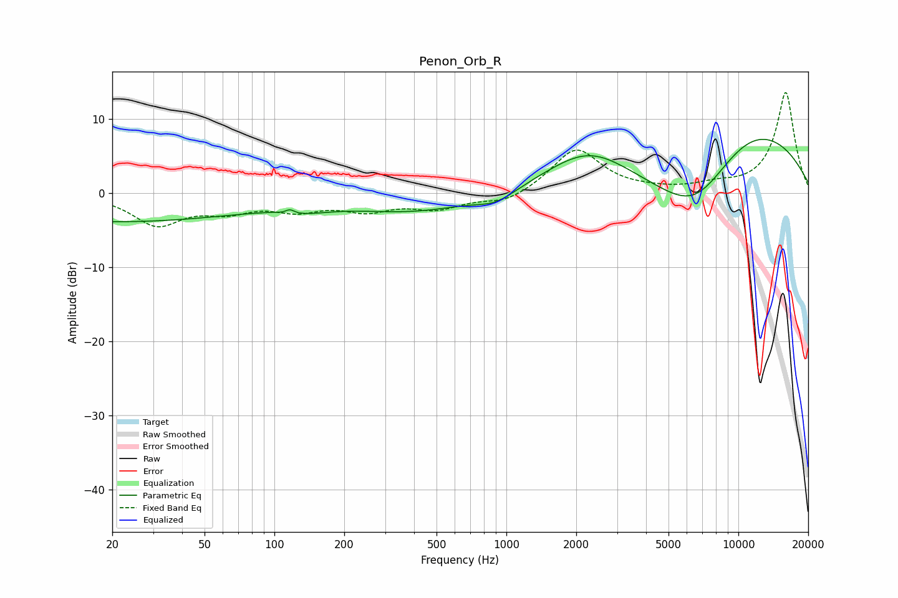

# Penon_Orb_R
See [usage instructions](https://github.com/jaakkopasanen/AutoEq#usage) for more options and info.

### Parametric EQs
Apply preamp of -7.4 dB when using parametric equalizer.

|   # | Type    |   Fc (Hz) |    Q |   Gain (dB) |
|-----|---------|-----------|------|-------------|
|   1 | Peaking |        20 | 0.23 |        -3.8 |
|   2 | Peaking |       111 | 2.58 |         0.4 |
|   3 | Peaking |       116 | 4.91 |        -3   |
|   4 | Peaking |       116 | 5.66 |         3.2 |
|   5 | Peaking |       137 | 1.25 |        -0.9 |
|   6 | Peaking |       404 | 0.52 |        -2.4 |
|   7 | Peaking |       907 | 1.72 |        -1.4 |
|   8 | Peaking |      2256 | 0.76 |         5.4 |
|   9 | Peaking |      6515 | 0.64 |       -11.3 |
|  10 | Peaking |     10000 | 0.37 |        12.5 |

### Fixed Band EQs
When using fixed band (also called graphic) equalizer, apply preamp of **-13.7 dB** (if available) and set gains manually with these parameters.

|   # | Type    |   Fc (Hz) |    Q |   Gain (dB) |
|-----|---------|-----------|------|-------------|
|   1 | Peaking |        31 | 1.41 |        -4.1 |
|   2 | Peaking |        62 | 1.41 |        -2   |
|   3 | Peaking |       125 | 1.41 |        -1.9 |
|   4 | Peaking |       250 | 1.41 |        -2   |
|   5 | Peaking |       500 | 1.41 |        -1.9 |
|   6 | Peaking |      1000 | 1.41 |        -1.4 |
|   7 | Peaking |      2000 | 1.41 |         6   |
|   8 | Peaking |      4000 | 1.41 |         0.2 |
|   9 | Peaking |      8000 | 1.41 |         0.8 |
|  10 | Peaking |     16000 | 1.41 |        13.6 |

### Graphs

