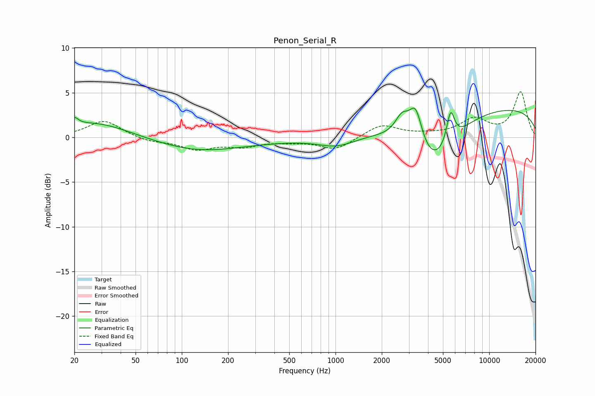

# Penon_Serial_R
See [usage instructions](https://github.com/jaakkopasanen/AutoEq#usage) for more options and info.

### Parametric EQs
Apply preamp of -3.4 dB when using parametric equalizer.

|   # | Type    |   Fc (Hz) |    Q |   Gain (dB) |
|-----|---------|-----------|------|-------------|
|   1 | Peaking |        20 | 5.84 |         0.8 |
|   2 | Peaking |        27 | 0.61 |         1.8 |
|   3 | Peaking |       175 | 0.44 |        -3.2 |
|   4 | Peaking |       212 | 0.51 |         1.8 |
|   5 | Peaking |      1018 | 1.19 |        -1.1 |
|   6 | Peaking |      2712 | 3.06 |         2.3 |
|   7 | Peaking |      3324 | 3.31 |         4.1 |
|   8 | Peaking |      4344 | 0.98 |        -5.7 |
|   9 | Peaking |      5604 | 5.31 |         3.6 |
|  10 | Peaking |      9971 | 0.2  |         3.5 |

### Fixed Band EQs
When using fixed band (also called graphic) equalizer, apply preamp of **-5.2 dB** (if available) and set gains manually with these parameters.

|   # | Type    |   Fc (Hz) |    Q |   Gain (dB) |
|-----|---------|-----------|------|-------------|
|   1 | Peaking |        31 | 1.41 |         1.9 |
|   2 | Peaking |        62 | 1.41 |        -0.5 |
|   3 | Peaking |       125 | 1.41 |        -1.2 |
|   4 | Peaking |       250 | 1.41 |        -0.9 |
|   5 | Peaking |       500 | 1.41 |        -0.3 |
|   6 | Peaking |      1000 | 1.41 |        -1.4 |
|   7 | Peaking |      2000 | 1.41 |         1.4 |
|   8 | Peaking |      4000 | 1.41 |         0.2 |
|   9 | Peaking |      8000 | 1.41 |         1.9 |
|  10 | Peaking |     16000 | 1.41 |         5   |

### Graphs

