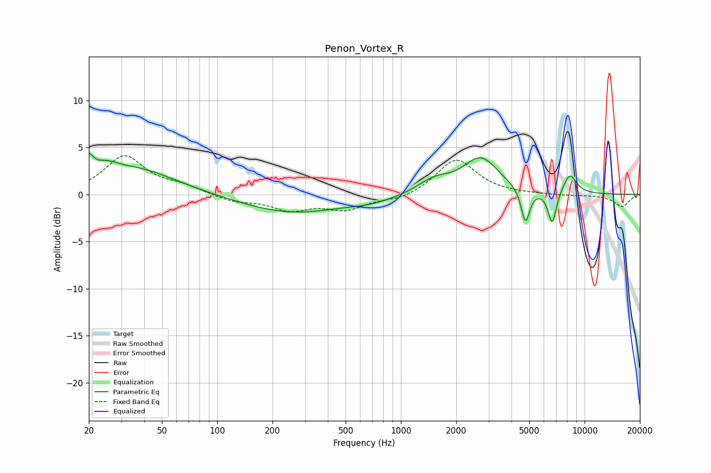

# Penon_Vortex_R
See [usage instructions](https://github.com/jaakkopasanen/AutoEq#usage) for more options and info.

### Parametric EQs
Apply preamp of -4.4 dB when using parametric equalizer.

|   # | Type    |   Fc (Hz) |    Q |   Gain (dB) |
|-----|---------|-----------|------|-------------|
|   1 | Peaking |        20 | 5.55 |         2   |
|   2 | Peaking |        25 | 2.18 |         1.2 |
|   3 | Peaking |        35 | 0.63 |         2.7 |
|   4 | Peaking |       254 | 0.52 |        -2   |
|   5 | Peaking |       698 | 1.15 |        -0.5 |
|   6 | Peaking |      1521 | 1.58 |         1.3 |
|   7 | Peaking |      2723 | 1.45 |         3.8 |
|   8 | Peaking |      4764 | 6    |        -3.7 |
|   9 | Peaking |      6662 | 6    |        -3.5 |
|  10 | Peaking |      8310 | 3.55 |         2.1 |

### Fixed Band EQs
When using fixed band (also called graphic) equalizer, apply preamp of **-4.2 dB** (if available) and set gains manually with these parameters.

|   # | Type    |   Fc (Hz) |    Q |   Gain (dB) |
|-----|---------|-----------|------|-------------|
|   1 | Peaking |        31 | 1.41 |         4   |
|   2 | Peaking |        62 | 1.41 |         0.8 |
|   3 | Peaking |       125 | 1.41 |        -0.7 |
|   4 | Peaking |       250 | 1.41 |        -1.5 |
|   5 | Peaking |       500 | 1.41 |        -1.5 |
|   6 | Peaking |      1000 | 1.41 |        -0.6 |
|   7 | Peaking |      2000 | 1.41 |         3.8 |
|   8 | Peaking |      4000 | 1.41 |         0   |
|   9 | Peaking |      8000 | 1.41 |        -0.1 |
|  10 | Peaking |     16000 | 1.41 |        -1.3 |

### Graphs

