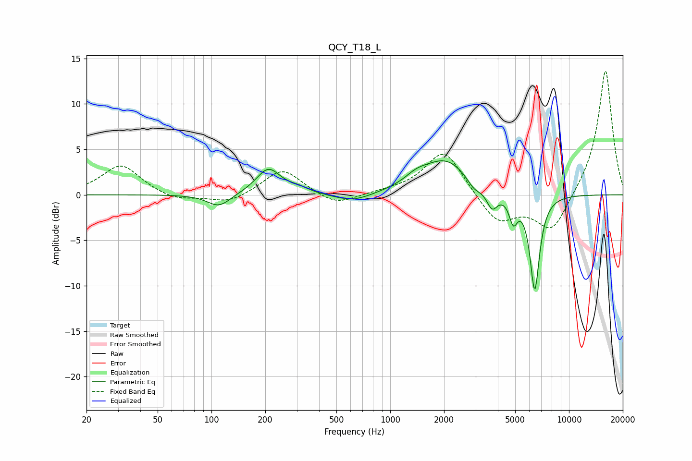

# QCY_T18_L
See [usage instructions](https://github.com/jaakkopasanen/AutoEq#usage) for more options and info.

### Parametric EQs
Apply preamp of -3.8 dB when using parametric equalizer.

|   # | Type    |   Fc (Hz) |    Q |   Gain (dB) |
|-----|---------|-----------|------|-------------|
|   1 | Peaking |       110 | 2.19 |        -1.4 |
|   2 | Peaking |       208 | 2.06 |         2.9 |
|   3 | Peaking |       307 | 2.56 |         0.5 |
|   4 | Peaking |       620 | 1.35 |        -0.9 |
|   5 | Peaking |      1399 | 2.27 |         0.8 |
|   6 | Peaking |      2043 | 1.06 |         3.8 |
|   7 | Peaking |      2944 | 3.44 |        -1.1 |
|   8 | Peaking |      3714 | 4.51 |        -2.1 |
|   9 | Peaking |      4880 | 5.99 |        -2.6 |
|  10 | Peaking |      6434 | 4.96 |       -10.5 |

### Fixed Band EQs
When using fixed band (also called graphic) equalizer, apply preamp of **-13.7 dB** (if available) and set gains manually with these parameters.

|   # | Type    |   Fc (Hz) |    Q |   Gain (dB) |
|-----|---------|-----------|------|-------------|
|   1 | Peaking |        31 | 1.41 |         3.3 |
|   2 | Peaking |        62 | 1.41 |        -0.7 |
|   3 | Peaking |       125 | 1.41 |        -1   |
|   4 | Peaking |       250 | 1.41 |         2.9 |
|   5 | Peaking |       500 | 1.41 |        -1.3 |
|   6 | Peaking |      1000 | 1.41 |         0.2 |
|   7 | Peaking |      2000 | 1.41 |         5   |
|   8 | Peaking |      4000 | 1.41 |        -3.2 |
|   9 | Peaking |      8000 | 1.41 |        -4.2 |
|  10 | Peaking |     16000 | 1.41 |        13.9 |

### Graphs

