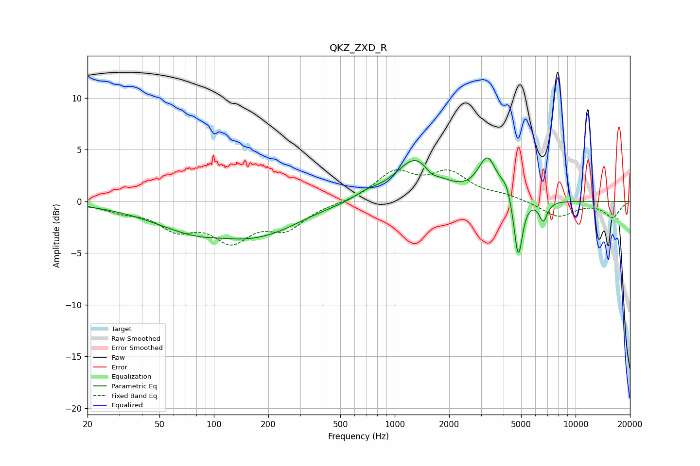

# QKZ_ZXD_R
See [usage instructions](https://github.com/jaakkopasanen/AutoEq#usage) for more options and info.

### Parametric EQs
Apply preamp of -4.3 dB when using parametric equalizer.

|   # | Type    |   Fc (Hz) |    Q |   Gain (dB) |
|-----|---------|-----------|------|-------------|
|   1 | Peaking |       109 | 1.28 |         0.6 |
|   2 | Peaking |       109 | 0.48 |        -4   |
|   3 | Peaking |       226 | 0.96 |        -0.6 |
|   4 | Peaking |       702 | 2.1  |         0.6 |
|   5 | Peaking |      1316 | 1.25 |         4.2 |
|   6 | Peaking |      1590 | 3.76 |        -0.8 |
|   7 | Peaking |      3257 | 2.76 |         3.8 |
|   8 | Peaking |      4135 | 4.89 |         1.2 |
|   9 | Peaking |      4819 | 6    |        -6   |
|  10 | Peaking |      6631 | 6    |        -1.9 |

### Fixed Band EQs
When using fixed band (also called graphic) equalizer, apply preamp of **-3.1 dB** (if available) and set gains manually with these parameters.

|   # | Type    |   Fc (Hz) |    Q |   Gain (dB) |
|-----|---------|-----------|------|-------------|
|   1 | Peaking |        31 | 1.41 |        -0.8 |
|   2 | Peaking |        62 | 1.41 |        -2.3 |
|   3 | Peaking |       125 | 1.41 |        -3.4 |
|   4 | Peaking |       250 | 1.41 |        -2.4 |
|   5 | Peaking |       500 | 1.41 |        -0.1 |
|   6 | Peaking |      1000 | 1.41 |         2.7 |
|   7 | Peaking |      2000 | 1.41 |         2.5 |
|   8 | Peaking |      4000 | 1.41 |         0.5 |
|   9 | Peaking |      8000 | 1.41 |        -1.5 |
|  10 | Peaking |     16000 | 1.41 |        -1.5 |

### Graphs

