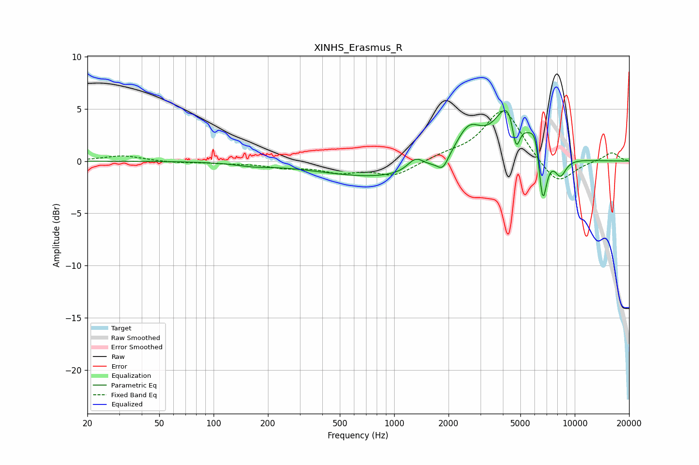

# XINHS_Erasmus_R
See [usage instructions](https://github.com/jaakkopasanen/AutoEq#usage) for more options and info.

### Parametric EQs
Apply preamp of -4.9 dB when using parametric equalizer.

|   # | Type    |   Fc (Hz) |    Q |   Gain (dB) |
|-----|---------|-----------|------|-------------|
|   1 | Peaking |       165 | 1.5  |        -0.3 |
|   2 | Peaking |       927 | 0.38 |        -1.6 |
|   3 | Peaking |      1315 | 3.14 |         1.2 |
|   4 | Peaking |      1859 | 4.75 |        -1.1 |
|   5 | Peaking |      2582 | 1.91 |         3.3 |
|   6 | Peaking |      4383 | 1.84 |         5.9 |
|   7 | Peaking |      4732 | 6    |        -3.8 |
|   8 | Peaking |      6062 | 4.61 |         2.3 |
|   9 | Peaking |      6635 | 6    |        -5.5 |
|  10 | Peaking |      8333 | 4.15 |        -1.7 |

### Fixed Band EQs
When using fixed band (also called graphic) equalizer, apply preamp of **-4.9 dB** (if available) and set gains manually with these parameters.

|   # | Type    |   Fc (Hz) |    Q |   Gain (dB) |
|-----|---------|-----------|------|-------------|
|   1 | Peaking |        31 | 1.41 |         0.5 |
|   2 | Peaking |        62 | 1.41 |        -0.2 |
|   3 | Peaking |       125 | 1.41 |        -0.2 |
|   4 | Peaking |       250 | 1.41 |        -0.5 |
|   5 | Peaking |       500 | 1.41 |        -0.9 |
|   6 | Peaking |      1000 | 1.41 |        -1.4 |
|   7 | Peaking |      2000 | 1.41 |         0.5 |
|   8 | Peaking |      4000 | 1.41 |         5.1 |
|   9 | Peaking |      8000 | 1.41 |        -2.5 |
|  10 | Peaking |     16000 | 1.41 |         0.9 |

### Graphs

