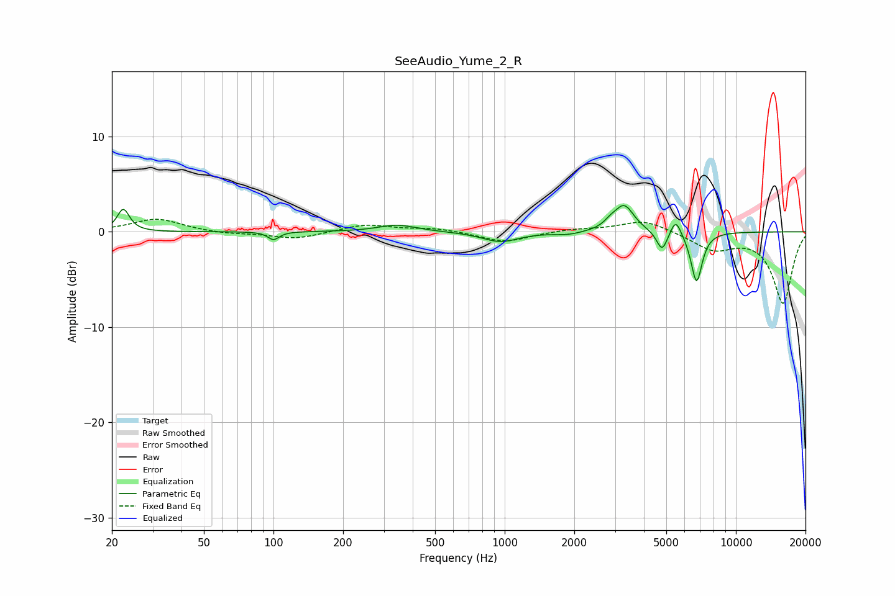

# SeeAudio_Yume_2_R
See [usage instructions](https://github.com/jaakkopasanen/AutoEq#usage) for more options and info.

### Parametric EQs
Apply preamp of -2.9 dB when using parametric equalizer.

|   # | Type    |   Fc (Hz) |    Q |   Gain (dB) |
|-----|---------|-----------|------|-------------|
|   1 | Peaking |        22 | 5.54 |         2.4 |
|   2 | Peaking |       100 | 5.98 |        -0.8 |
|   3 | Peaking |       344 | 1.7  |         0.7 |
|   4 | Peaking |       958 | 1.8  |        -1.1 |
|   5 | Peaking |      1877 | 2.42 |        -0.3 |
|   6 | Peaking |      2858 | 5.3  |         0.5 |
|   7 | Peaking |      3286 | 3.33 |         2.8 |
|   8 | Peaking |      4796 | 5.99 |        -2.1 |
|   9 | Peaking |      5494 | 6    |         1.8 |
|  10 | Peaking |      6759 | 5.59 |        -5.3 |

### Fixed Band EQs
When using fixed band (also called graphic) equalizer, apply preamp of **-1.4 dB** (if available) and set gains manually with these parameters.

|   # | Type    |   Fc (Hz) |    Q |   Gain (dB) |
|-----|---------|-----------|------|-------------|
|   1 | Peaking |        31 | 1.41 |         1.4 |
|   2 | Peaking |        62 | 1.41 |        -0.2 |
|   3 | Peaking |       125 | 1.41 |        -0.8 |
|   4 | Peaking |       250 | 1.41 |         0.8 |
|   5 | Peaking |       500 | 1.41 |         0.4 |
|   6 | Peaking |      1000 | 1.41 |        -1.1 |
|   7 | Peaking |      2000 | 1.41 |         0.3 |
|   8 | Peaking |      4000 | 1.41 |         1.3 |
|   9 | Peaking |      8000 | 1.41 |        -1.8 |
|  10 | Peaking |     16000 | 1.41 |        -7.5 |

### Graphs

