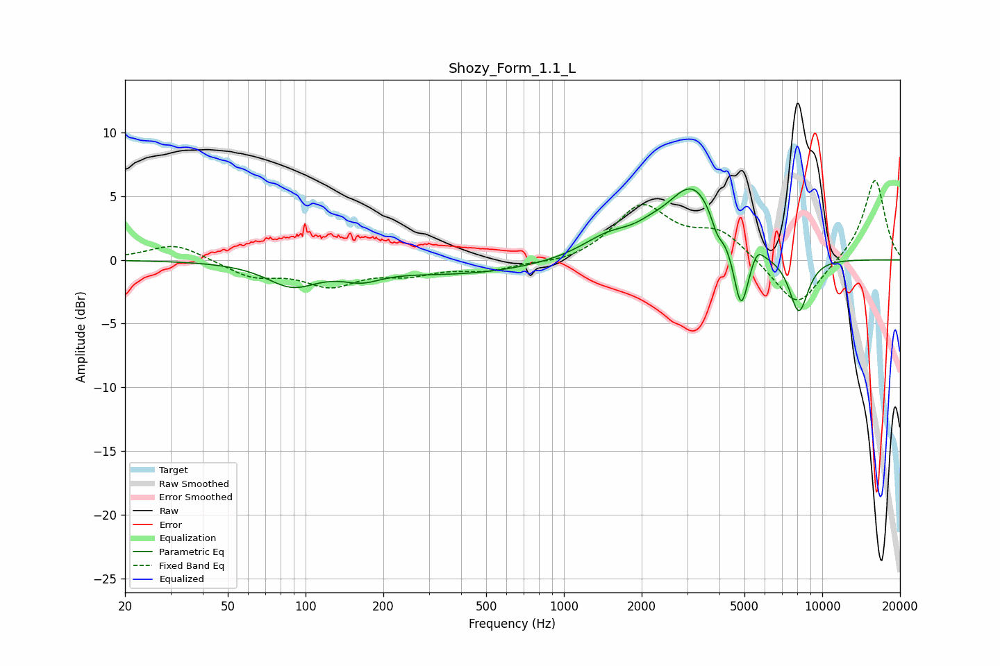

# Shozy_Form_1.1_L
See [usage instructions](https://github.com/jaakkopasanen/AutoEq#usage) for more options and info.

### Parametric EQs
Apply preamp of -5.7 dB when using parametric equalizer.

|   # | Type    |   Fc (Hz) |    Q |   Gain (dB) |
|-----|---------|-----------|------|-------------|
|   1 | Peaking |        89 | 1.44 |        -1.8 |
|   2 | Peaking |       165 | 1.87 |        -0.9 |
|   3 | Peaking |       404 | 0.46 |        -1.1 |
|   4 | Peaking |      1481 | 1.35 |         1.5 |
|   5 | Peaking |      2161 | 2.57 |         0.4 |
|   6 | Peaking |      3169 | 1.32 |         5.8 |
|   7 | Peaking |      3923 | 5.99 |        -1.3 |
|   8 | Peaking |      4846 | 4.7  |        -5.4 |
|   9 | Peaking |      5604 | 6    |         0.9 |
|  10 | Peaking |      8114 | 3.49 |        -4.4 |

### Fixed Band EQs
When using fixed band (also called graphic) equalizer, apply preamp of **-6.3 dB** (if available) and set gains manually with these parameters.

|   # | Type    |   Fc (Hz) |    Q |   Gain (dB) |
|-----|---------|-----------|------|-------------|
|   1 | Peaking |        31 | 1.41 |         1.3 |
|   2 | Peaking |        62 | 1.41 |        -1.2 |
|   3 | Peaking |       125 | 1.41 |        -1.8 |
|   4 | Peaking |       250 | 1.41 |        -0.9 |
|   5 | Peaking |       500 | 1.41 |        -0.7 |
|   6 | Peaking |      1000 | 1.41 |        -0.4 |
|   7 | Peaking |      2000 | 1.41 |         4.2 |
|   8 | Peaking |      4000 | 1.41 |         2.1 |
|   9 | Peaking |      8000 | 1.41 |        -3.9 |
|  10 | Peaking |     16000 | 1.41 |         6.4 |

### Graphs

