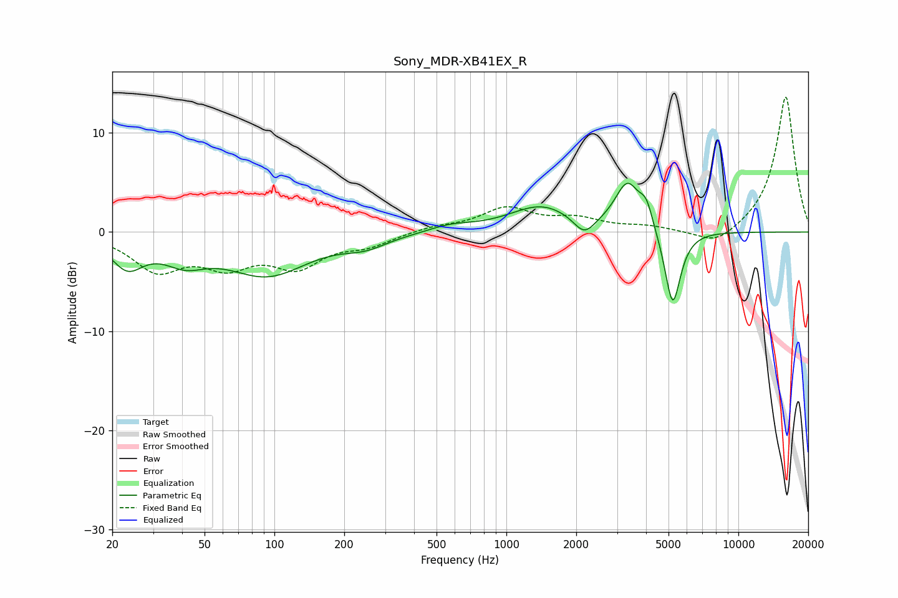

# Sony_MDR-XB41EX_R
See [usage instructions](https://github.com/jaakkopasanen/AutoEq#usage) for more options and info.

### Parametric EQs
Apply preamp of -5.0 dB when using parametric equalizer.

|   # | Type    |   Fc (Hz) |    Q |   Gain (dB) |
|-----|---------|-----------|------|-------------|
|   1 | Peaking |        23 | 2.05 |        -3   |
|   2 | Peaking |        41 | 1.53 |        -2.1 |
|   3 | Peaking |        93 | 0.8  |        -4.2 |
|   4 | Peaking |       247 | 1.46 |        -1.1 |
|   5 | Peaking |       575 | 1.5  |         0.6 |
|   6 | Peaking |      1418 | 1.02 |         2.6 |
|   7 | Peaking |      2167 | 3.07 |        -1.9 |
|   8 | Peaking |      3326 | 2.63 |         4.7 |
|   9 | Peaking |      4011 | 4.91 |         2.1 |
|  10 | Peaking |      5210 | 4.04 |        -7.9 |

### Fixed Band EQs
When using fixed band (also called graphic) equalizer, apply preamp of **-13.7 dB** (if available) and set gains manually with these parameters.

|   # | Type    |   Fc (Hz) |    Q |   Gain (dB) |
|-----|---------|-----------|------|-------------|
|   1 | Peaking |        31 | 1.41 |        -3.6 |
|   2 | Peaking |        62 | 1.41 |        -2.9 |
|   3 | Peaking |       125 | 1.41 |        -3.1 |
|   4 | Peaking |       250 | 1.41 |        -1.2 |
|   5 | Peaking |       500 | 1.41 |         0.5 |
|   6 | Peaking |      1000 | 1.41 |         2.3 |
|   7 | Peaking |      2000 | 1.41 |         1.2 |
|   8 | Peaking |      4000 | 1.41 |         0.5 |
|   9 | Peaking |      8000 | 1.41 |        -1.6 |
|  10 | Peaking |     16000 | 1.41 |        13.8 |

### Graphs

