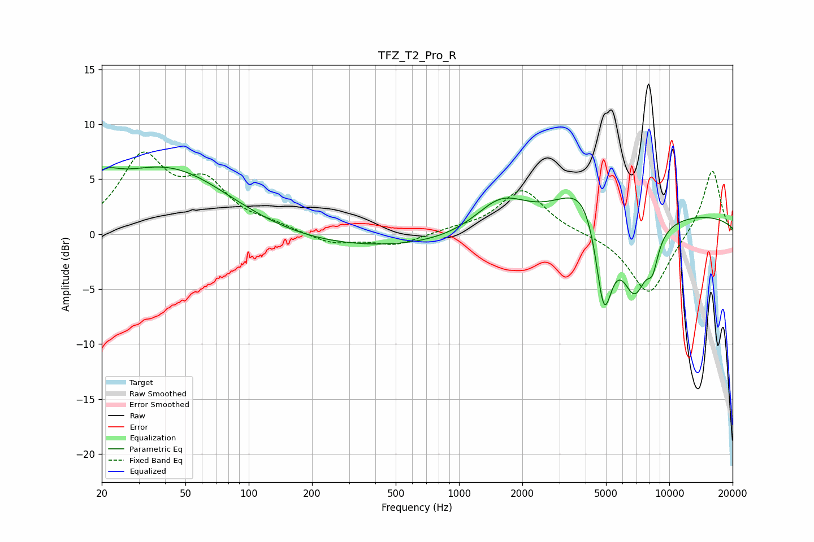

# TFZ_T2_Pro_R
See [usage instructions](https://github.com/jaakkopasanen/AutoEq#usage) for more options and info.

### Parametric EQs
Apply preamp of -6.2 dB when using parametric equalizer.

|   # | Type    |   Fc (Hz) |    Q |   Gain (dB) |
|-----|---------|-----------|------|-------------|
|   1 | Peaking |        20 | 2.04 |         2.1 |
|   2 | Peaking |        20 | 5.89 |        -0.2 |
|   3 | Peaking |        41 | 0.46 |         6.3 |
|   4 | Peaking |       329 | 0.21 |        -1.5 |
|   5 | Peaking |      1579 | 1.15 |         3   |
|   6 | Peaking |      4188 | 1.19 |         5.1 |
|   7 | Peaking |      4883 | 3.07 |       -10.3 |
|   8 | Peaking |      6842 | 2.03 |        -6.9 |
|   9 | Peaking |      8332 | 4.89 |        -2.3 |
|  10 | Peaking |     10000 | 0.2  |         1.8 |

### Fixed Band EQs
When using fixed band (also called graphic) equalizer, apply preamp of **-7.6 dB** (if available) and set gains manually with these parameters.

|   # | Type    |   Fc (Hz) |    Q |   Gain (dB) |
|-----|---------|-----------|------|-------------|
|   1 | Peaking |        31 | 1.41 |         6.7 |
|   2 | Peaking |        62 | 1.41 |         4   |
|   3 | Peaking |       125 | 1.41 |         0.6 |
|   4 | Peaking |       250 | 1.41 |        -0.9 |
|   5 | Peaking |       500 | 1.41 |        -1   |
|   6 | Peaking |      1000 | 1.41 |         0.4 |
|   7 | Peaking |      2000 | 1.41 |         4.1 |
|   8 | Peaking |      4000 | 1.41 |         0   |
|   9 | Peaking |      8000 | 1.41 |        -5.6 |
|  10 | Peaking |     16000 | 1.41 |         6   |

### Graphs

