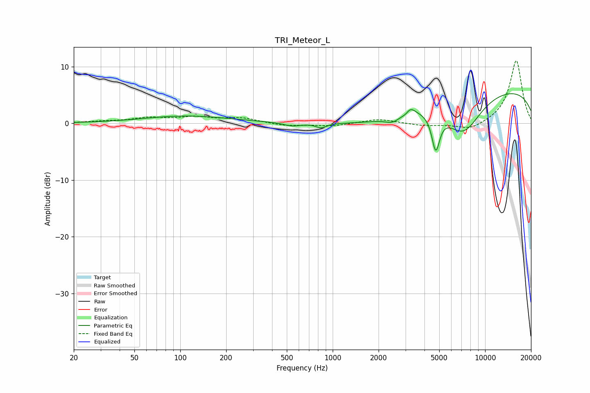

# TRI_Meteor_L
See [usage instructions](https://github.com/jaakkopasanen/AutoEq#usage) for more options and info.

### Parametric EQs
Apply preamp of -5.3 dB when using parametric equalizer.

|   # | Type    |   Fc (Hz) |    Q |   Gain (dB) |
|-----|---------|-----------|------|-------------|
|   1 | Peaking |       110 | 0.51 |         1.3 |
|   2 | Peaking |       542 | 2.52 |        -0.6 |
|   3 | Peaking |       840 | 4.11 |        -0.8 |
|   4 | Peaking |      2047 | 0.59 |        -1.8 |
|   5 | Peaking |      2472 | 2.83 |        -1.1 |
|   6 | Peaking |      3026 | 5.97 |        -0.4 |
|   7 | Peaking |      3219 | 4.4  |         1.3 |
|   8 | Peaking |      4745 | 5.36 |        -6.4 |
|   9 | Peaking |      7200 | 1.11 |        -7   |
|  10 | Peaking |     10000 | 0.18 |         6.5 |

### Fixed Band EQs
When using fixed band (also called graphic) equalizer, apply preamp of **-11.1 dB** (if available) and set gains manually with these parameters.

|   # | Type    |   Fc (Hz) |    Q |   Gain (dB) |
|-----|---------|-----------|------|-------------|
|   1 | Peaking |        31 | 1.41 |         0.3 |
|   2 | Peaking |        62 | 1.41 |         0.9 |
|   3 | Peaking |       125 | 1.41 |         1   |
|   4 | Peaking |       250 | 1.41 |         0.9 |
|   5 | Peaking |       500 | 1.41 |        -0.5 |
|   6 | Peaking |      1000 | 1.41 |        -0.5 |
|   7 | Peaking |      2000 | 1.41 |         0.8 |
|   8 | Peaking |      4000 | 1.41 |        -0.4 |
|   9 | Peaking |      8000 | 1.41 |        -1.3 |
|  10 | Peaking |     16000 | 1.41 |        11.2 |

### Graphs

