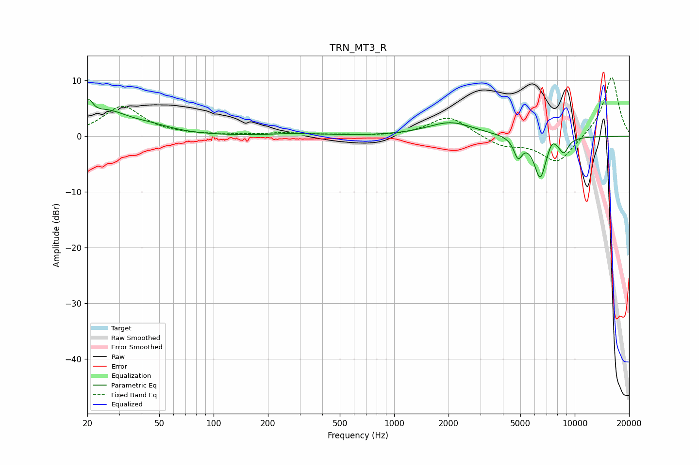

# TRN_MT3_R
See [usage instructions](https://github.com/jaakkopasanen/AutoEq#usage) for more options and info.

### Parametric EQs
Apply preamp of -6.7 dB when using parametric equalizer.

|   # | Type    |   Fc (Hz) |    Q |   Gain (dB) |
|-----|---------|-----------|------|-------------|
|   1 | Peaking |        20 | 5.96 |         3.2 |
|   2 | Peaking |        25 | 1.17 |         4   |
|   3 | Peaking |        45 | 1.15 |         1.2 |
|   4 | Peaking |       264 | 1.27 |         0.3 |
|   5 | Peaking |       395 | 1.31 |         0.2 |
|   6 | Peaking |      2055 | 1.1  |         2.5 |
|   7 | Peaking |      4855 | 5.95 |        -3.4 |
|   8 | Peaking |      6436 | 4.05 |        -7.4 |
|   9 | Peaking |      7486 | 5.96 |         1.4 |
|  10 | Peaking |      8692 | 5.04 |        -2.5 |

### Fixed Band EQs
When using fixed band (also called graphic) equalizer, apply preamp of **-10.7 dB** (if available) and set gains manually with these parameters.

|   # | Type    |   Fc (Hz) |    Q |   Gain (dB) |
|-----|---------|-----------|------|-------------|
|   1 | Peaking |        31 | 1.41 |         5.3 |
|   2 | Peaking |        62 | 1.41 |         0.1 |
|   3 | Peaking |       125 | 1.41 |         0.2 |
|   4 | Peaking |       250 | 1.41 |         0.5 |
|   5 | Peaking |       500 | 1.41 |         0.2 |
|   6 | Peaking |      1000 | 1.41 |        -0.1 |
|   7 | Peaking |      2000 | 1.41 |         3.7 |
|   8 | Peaking |      4000 | 1.41 |        -1.8 |
|   9 | Peaking |      8000 | 1.41 |        -4.9 |
|  10 | Peaking |     16000 | 1.41 |        10.9 |

### Graphs

