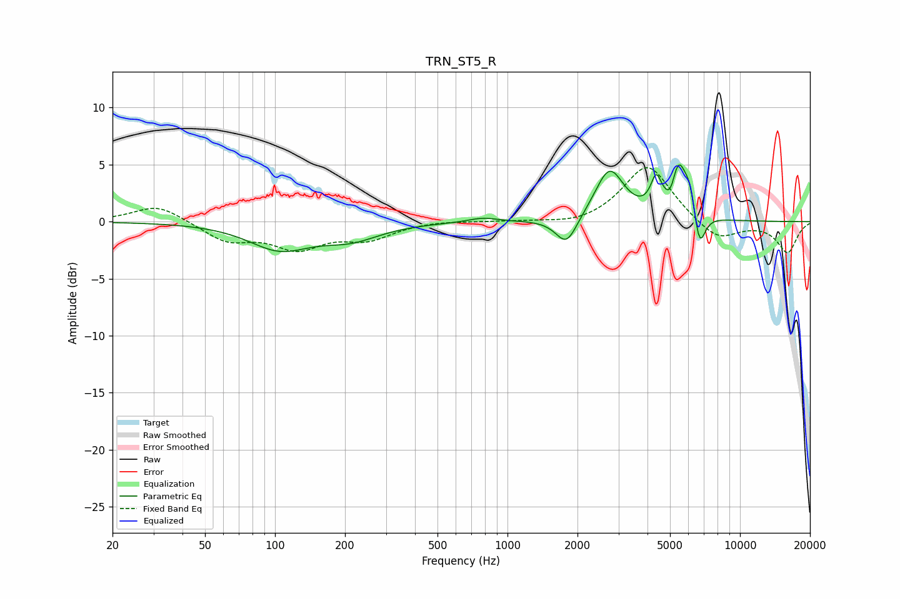

# TRN_ST5_R
See [usage instructions](https://github.com/jaakkopasanen/AutoEq#usage) for more options and info.

### Parametric EQs
Apply preamp of -5.1 dB when using parametric equalizer.

|   # | Type    |   Fc (Hz) |    Q |   Gain (dB) |
|-----|---------|-----------|------|-------------|
|   1 | Peaking |       105 | 1.07 |        -2.3 |
|   2 | Peaking |       212 | 1.13 |        -1.3 |
|   3 | Peaking |       783 | 2.24 |         0.4 |
|   4 | Peaking |      1794 | 3.1  |        -2.5 |
|   5 | Peaking |      2745 | 2.28 |         4.5 |
|   6 | Peaking |      4360 | 5.96 |         2.6 |
|   7 | Peaking |      5050 | 6    |        -1.6 |
|   8 | Peaking |      5416 | 3.89 |         5   |
|   9 | Peaking |      6093 | 5.97 |         2   |
|  10 | Peaking |      6692 | 5.53 |        -3.4 |

### Fixed Band EQs
When using fixed band (also called graphic) equalizer, apply preamp of **-4.8 dB** (if available) and set gains manually with these parameters.

|   # | Type    |   Fc (Hz) |    Q |   Gain (dB) |
|-----|---------|-----------|------|-------------|
|   1 | Peaking |        31 | 1.41 |         1.5 |
|   2 | Peaking |        62 | 1.41 |        -1.6 |
|   3 | Peaking |       125 | 1.41 |        -2.1 |
|   4 | Peaking |       250 | 1.41 |        -1.4 |
|   5 | Peaking |       500 | 1.41 |         0.1 |
|   6 | Peaking |      1000 | 1.41 |         0   |
|   7 | Peaking |      2000 | 1.41 |        -0.4 |
|   8 | Peaking |      4000 | 1.41 |         5.1 |
|   9 | Peaking |      8000 | 1.41 |        -1.8 |
|  10 | Peaking |     16000 | 1.41 |        -2.7 |

### Graphs

