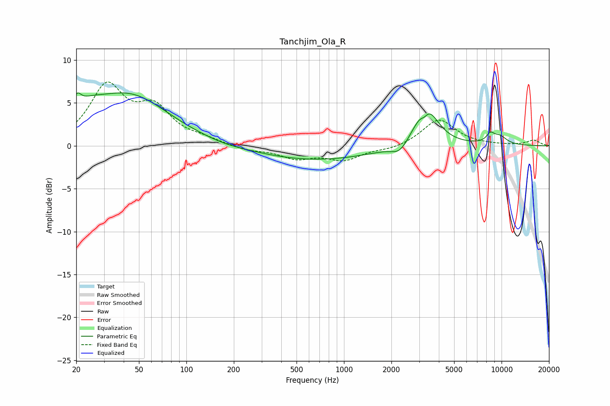

# Tanchjim_Ola_R
See [usage instructions](https://github.com/jaakkopasanen/AutoEq#usage) for more options and info.

### Parametric EQs
Apply preamp of -6.3 dB when using parametric equalizer.

|   # | Type    |   Fc (Hz) |    Q |   Gain (dB) |
|-----|---------|-----------|------|-------------|
|   1 | Peaking |        20 | 5.89 |         1.5 |
|   2 | Peaking |        23 | 1.28 |         1.9 |
|   3 | Peaking |        44 | 0.57 |         5.7 |
|   4 | Peaking |       172 | 1.29 |        -0.2 |
|   5 | Peaking |       652 | 0.37 |        -1.7 |
|   6 | Peaking |      2261 | 2.71 |        -1.2 |
|   7 | Peaking |      3235 | 5.93 |        -0.9 |
|   8 | Peaking |      3313 | 1.88 |         4.9 |
|   9 | Peaking |      8488 | 5.11 |         0.9 |
|  10 | Peaking |      9720 | 2.61 |         1   |

### Fixed Band EQs
When using fixed band (also called graphic) equalizer, apply preamp of **-7.5 dB** (if available) and set gains manually with these parameters.

|   # | Type    |   Fc (Hz) |    Q |   Gain (dB) |
|-----|---------|-----------|------|-------------|
|   1 | Peaking |        31 | 1.41 |         6.7 |
|   2 | Peaking |        62 | 1.41 |         3.9 |
|   3 | Peaking |       125 | 1.41 |         0.6 |
|   4 | Peaking |       250 | 1.41 |        -0.5 |
|   5 | Peaking |       500 | 1.41 |        -1.3 |
|   6 | Peaking |      1000 | 1.41 |        -1.5 |
|   7 | Peaking |      2000 | 1.41 |        -0.4 |
|   8 | Peaking |      4000 | 1.41 |         3.1 |
|   9 | Peaking |      8000 | 1.41 |         0.1 |
|  10 | Peaking |     16000 | 1.41 |         0.6 |

### Graphs

