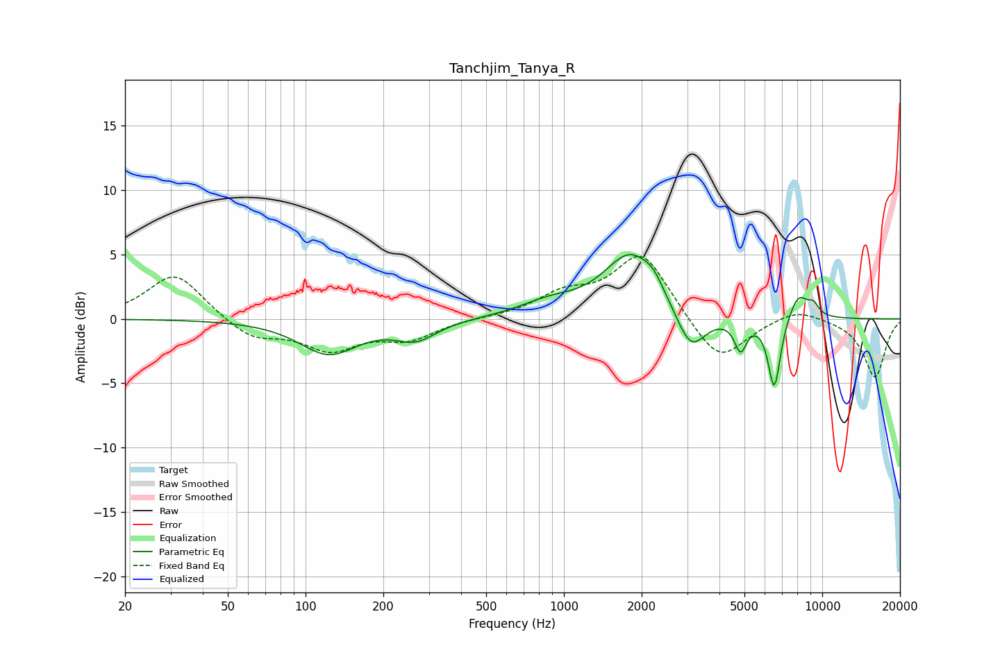

# Tanchjim_Tanya_R
See [usage instructions](https://github.com/jaakkopasanen/AutoEq#usage) for more options and info.

### Parametric EQs
Apply preamp of -5.1 dB when using parametric equalizer.

|   # | Type    |   Fc (Hz) |    Q |   Gain (dB) |
|-----|---------|-----------|------|-------------|
|   1 | Peaking |       123 | 1.25 |        -2.7 |
|   2 | Peaking |       267 | 1.77 |        -1.4 |
|   3 | Peaking |       877 | 1.22 |         1   |
|   4 | Peaking |      1815 | 1.35 |         4.9 |
|   5 | Peaking |      2226 | 3.76 |         0.8 |
|   6 | Peaking |      3098 | 2.48 |        -3.2 |
|   7 | Peaking |      4829 | 5.99 |        -2.3 |
|   8 | Peaking |      6522 | 5.7  |        -5.6 |
|   9 | Peaking |      8091 | 3.44 |         2   |
|  10 | Peaking |      9240 | 6    |         0.8 |

### Fixed Band EQs
When using fixed band (also called graphic) equalizer, apply preamp of **-4.9 dB** (if available) and set gains manually with these parameters.

|   # | Type    |   Fc (Hz) |    Q |   Gain (dB) |
|-----|---------|-----------|------|-------------|
|   1 | Peaking |        31 | 1.41 |         3.6 |
|   2 | Peaking |        62 | 1.41 |        -1.5 |
|   3 | Peaking |       125 | 1.41 |        -2.2 |
|   4 | Peaking |       250 | 1.41 |        -1.5 |
|   5 | Peaking |       500 | 1.41 |         0.1 |
|   6 | Peaking |      1000 | 1.41 |         1.7 |
|   7 | Peaking |      2000 | 1.41 |         5.1 |
|   8 | Peaking |      4000 | 1.41 |        -3.6 |
|   9 | Peaking |      8000 | 1.41 |         0.9 |
|  10 | Peaking |     16000 | 1.41 |        -4.5 |

### Graphs

