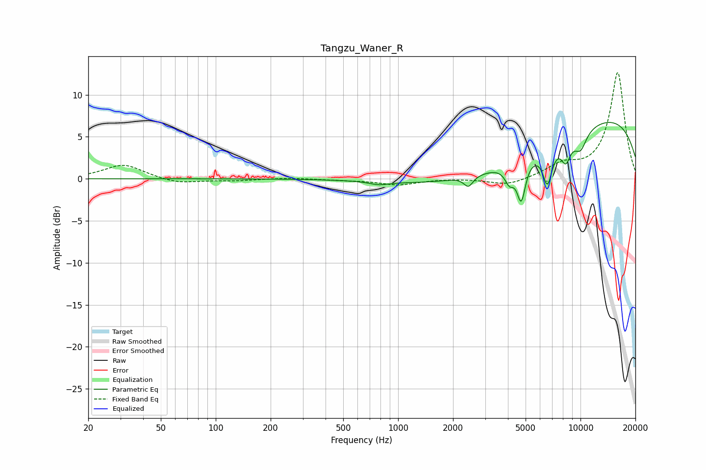

# Tangzu_Waner_R
See [usage instructions](https://github.com/jaakkopasanen/AutoEq#usage) for more options and info.

### Parametric EQs
Apply preamp of -6.8 dB when using parametric equalizer.

|   # | Type    |   Fc (Hz) |    Q |   Gain (dB) |
|-----|---------|-----------|------|-------------|
|   1 | Peaking |       786 | 2.73 |        -0.4 |
|   2 | Peaking |      2431 | 5.75 |        -1.3 |
|   3 | Peaking |      4008 | 0.33 |        -4.6 |
|   4 | Peaking |      4022 | 5.93 |         0.4 |
|   5 | Peaking |      4070 | 5.44 |        -2.3 |
|   6 | Peaking |      4734 | 5.96 |        -4.6 |
|   7 | Peaking |      6586 | 5.34 |        -4.2 |
|   8 | Peaking |      8311 | 5.03 |        -2.4 |
|   9 | Peaking |      9939 | 0.2  |         8.7 |
|  10 | Peaking |     10000 | 3.46 |        -2.2 |

### Fixed Band EQs
When using fixed band (also called graphic) equalizer, apply preamp of **-12.7 dB** (if available) and set gains manually with these parameters.

|   # | Type    |   Fc (Hz) |    Q |   Gain (dB) |
|-----|---------|-----------|------|-------------|
|   1 | Peaking |        31 | 1.41 |         1.7 |
|   2 | Peaking |        62 | 1.41 |        -0.6 |
|   3 | Peaking |       125 | 1.41 |        -0.2 |
|   4 | Peaking |       250 | 1.41 |         0.1 |
|   5 | Peaking |       500 | 1.41 |        -0.1 |
|   6 | Peaking |      1000 | 1.41 |        -0.7 |
|   7 | Peaking |      2000 | 1.41 |         0.1 |
|   8 | Peaking |      4000 | 1.41 |        -0.9 |
|   9 | Peaking |      8000 | 1.41 |         1.5 |
|  10 | Peaking |     16000 | 1.41 |        12.7 |

### Graphs

