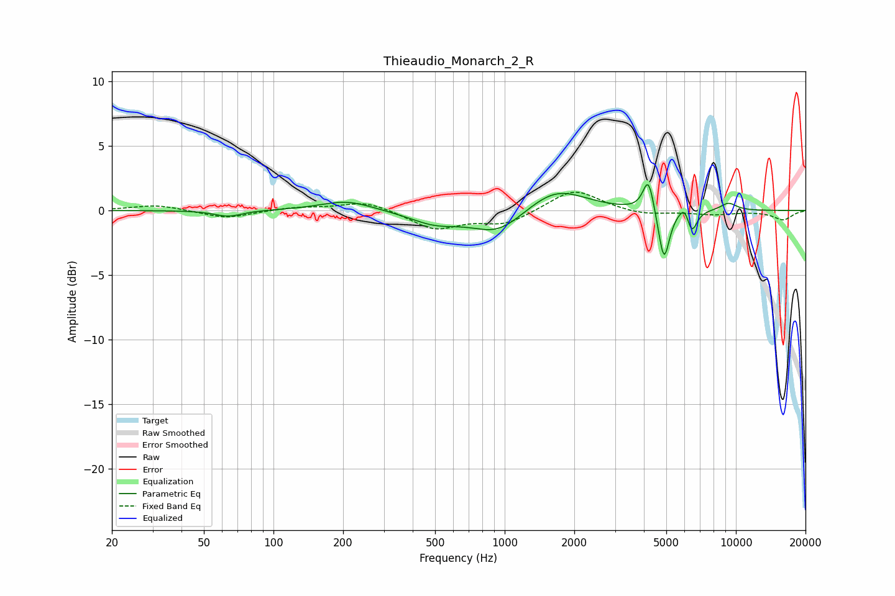

# Thieaudio_Monarch_2_R
See [usage instructions](https://github.com/jaakkopasanen/AutoEq#usage) for more options and info.

### Parametric EQs
Apply preamp of -2.1 dB when using parametric equalizer.

|   # | Type    |   Fc (Hz) |    Q |   Gain (dB) |
|-----|---------|-----------|------|-------------|
|   1 | Peaking |        64 | 2.4  |        -0.5 |
|   2 | Peaking |       207 | 1.25 |         0.8 |
|   3 | Peaking |       499 | 1.28 |        -0.9 |
|   4 | Peaking |       936 | 1.25 |        -1.8 |
|   5 | Peaking |      1665 | 1.12 |         1.9 |
|   6 | Peaking |      4183 | 6    |         2.6 |
|   7 | Peaking |      4885 | 5.94 |        -4.1 |
|   8 | Peaking |      6026 | 6    |         1.1 |
|   9 | Peaking |      6429 | 6    |        -1.9 |
|  10 | Peaking |      9292 | 3.52 |         0.6 |

### Fixed Band EQs
When using fixed band (also called graphic) equalizer, apply preamp of **-1.5 dB** (if available) and set gains manually with these parameters.

|   # | Type    |   Fc (Hz) |    Q |   Gain (dB) |
|-----|---------|-----------|------|-------------|
|   1 | Peaking |        31 | 1.41 |         0.4 |
|   2 | Peaking |        62 | 1.41 |        -0.6 |
|   3 | Peaking |       125 | 1.41 |         0.2 |
|   4 | Peaking |       250 | 1.41 |         0.7 |
|   5 | Peaking |       500 | 1.41 |        -1.4 |
|   6 | Peaking |      1000 | 1.41 |        -1   |
|   7 | Peaking |      2000 | 1.41 |         1.7 |
|   8 | Peaking |      4000 | 1.41 |        -0.4 |
|   9 | Peaking |      8000 | 1.41 |        -0.3 |
|  10 | Peaking |     16000 | 1.41 |        -0.7 |

### Graphs

