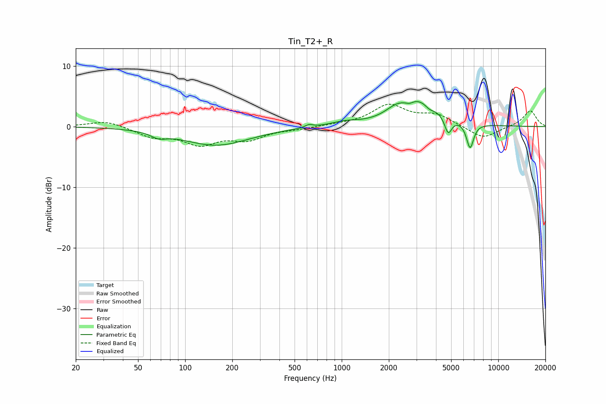

# Tin_T2+_R
See [usage instructions](https://github.com/jaakkopasanen/AutoEq#usage) for more options and info.

### Parametric EQs
Apply preamp of -4.2 dB when using parametric equalizer.

|   # | Type    |   Fc (Hz) |    Q |   Gain (dB) |
|-----|---------|-----------|------|-------------|
|   1 | Peaking |        68 | 2.93 |        -0.9 |
|   2 | Peaking |       157 | 0.66 |        -3.1 |
|   3 | Peaking |       618 | 6    |         0.5 |
|   4 | Peaking |      1039 | 1.67 |         0.6 |
|   5 | Peaking |      2203 | 2.22 |         1.1 |
|   6 | Peaking |      2708 | 6    |        -0.5 |
|   7 | Peaking |      3108 | 1.08 |         4.2 |
|   8 | Peaking |      3635 | 4.61 |        -0.8 |
|   9 | Peaking |      4788 | 6    |        -2.8 |
|  10 | Peaking |      6608 | 5.91 |        -4.2 |

### Fixed Band EQs
When using fixed band (also called graphic) equalizer, apply preamp of **-3.8 dB** (if available) and set gains manually with these parameters.

|   # | Type    |   Fc (Hz) |    Q |   Gain (dB) |
|-----|---------|-----------|------|-------------|
|   1 | Peaking |        31 | 1.41 |         1   |
|   2 | Peaking |        62 | 1.41 |        -1.6 |
|   3 | Peaking |       125 | 1.41 |        -2.7 |
|   4 | Peaking |       250 | 1.41 |        -1.9 |
|   5 | Peaking |       500 | 1.41 |        -0.3 |
|   6 | Peaking |      1000 | 1.41 |         0.2 |
|   7 | Peaking |      2000 | 1.41 |         3.4 |
|   8 | Peaking |      4000 | 1.41 |         1.8 |
|   9 | Peaking |      8000 | 1.41 |        -2.1 |
|  10 | Peaking |     16000 | 1.41 |         2.7 |

### Graphs

