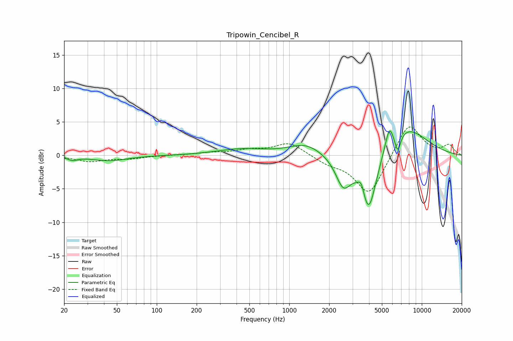

# Tripowin_Cencibel_R
See [usage instructions](https://github.com/jaakkopasanen/AutoEq#usage) for more options and info.

### Parametric EQs
Apply preamp of -3.8 dB when using parametric equalizer.

|   # | Type    |   Fc (Hz) |    Q |   Gain (dB) |
|-----|---------|-----------|------|-------------|
|   1 | Peaking |        23 | 3.89 |        -0.5 |
|   2 | Peaking |        44 | 1.05 |        -0.8 |
|   3 | Peaking |       435 | 0.78 |         0.9 |
|   4 | Peaking |      1331 | 1.14 |         1.7 |
|   5 | Peaking |      2557 | 2.41 |        -4.4 |
|   6 | Peaking |      3495 | 5.99 |         1.8 |
|   7 | Peaking |      3973 | 2.31 |        -9.2 |
|   8 | Peaking |      5688 | 4.65 |         3.1 |
|   9 | Peaking |      6581 | 6    |        -2.8 |
|  10 | Peaking |      7472 | 0.8  |         4.3 |

### Fixed Band EQs
When using fixed band (also called graphic) equalizer, apply preamp of **-4.3 dB** (if available) and set gains manually with these parameters.

|   # | Type    |   Fc (Hz) |    Q |   Gain (dB) |
|-----|---------|-----------|------|-------------|
|   1 | Peaking |        31 | 1.41 |        -0.9 |
|   2 | Peaking |        62 | 1.41 |        -0.4 |
|   3 | Peaking |       125 | 1.41 |         0   |
|   4 | Peaking |       250 | 1.41 |         0.3 |
|   5 | Peaking |       500 | 1.41 |         0.7 |
|   6 | Peaking |      1000 | 1.41 |         1.9 |
|   7 | Peaking |      2000 | 1.41 |        -1   |
|   8 | Peaking |      4000 | 1.41 |        -6   |
|   9 | Peaking |      8000 | 1.41 |         5.1 |
|  10 | Peaking |     16000 | 1.41 |         1.5 |

### Graphs

