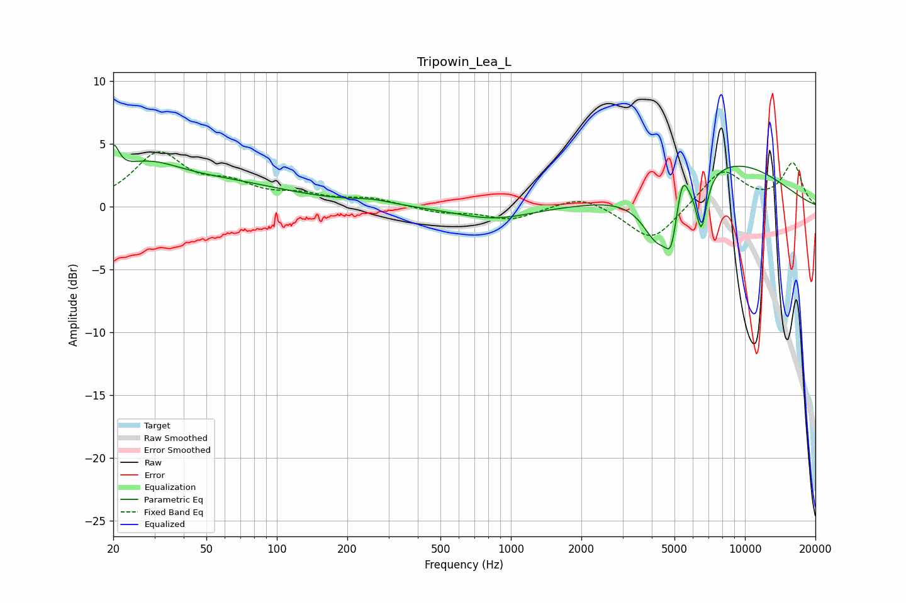

# Tripowin_Lea_L
See [usage instructions](https://github.com/jaakkopasanen/AutoEq#usage) for more options and info.

### Parametric EQs
Apply preamp of -5.0 dB when using parametric equalizer.

|   # | Type    |   Fc (Hz) |    Q |   Gain (dB) |
|-----|---------|-----------|------|-------------|
|   1 | Peaking |        20 | 5.96 |         2.4 |
|   2 | Peaking |        27 | 0.95 |         2.5 |
|   3 | Peaking |        59 | 0.49 |         1.6 |
|   4 | Peaking |       255 | 1.66 |         0.3 |
|   5 | Peaking |       848 | 0.86 |        -1   |
|   6 | Peaking |      4289 | 2.01 |        -4.6 |
|   7 | Peaking |      4842 | 6    |        -2.6 |
|   8 | Peaking |      5402 | 5.95 |         2.3 |
|   9 | Peaking |      6510 | 6    |        -4.2 |
|  10 | Peaking |      8224 | 0.48 |         3.7 |

### Fixed Band EQs
When using fixed band (also called graphic) equalizer, apply preamp of **-4.4 dB** (if available) and set gains manually with these parameters.

|   # | Type    |   Fc (Hz) |    Q |   Gain (dB) |
|-----|---------|-----------|------|-------------|
|   1 | Peaking |        31 | 1.41 |         4   |
|   2 | Peaking |        62 | 1.41 |         1.4 |
|   3 | Peaking |       125 | 1.41 |         0.7 |
|   4 | Peaking |       250 | 1.41 |         0.6 |
|   5 | Peaking |       500 | 1.41 |        -0.5 |
|   6 | Peaking |      1000 | 1.41 |        -1   |
|   7 | Peaking |      2000 | 1.41 |         1   |
|   8 | Peaking |      4000 | 1.41 |        -2.9 |
|   9 | Peaking |      8000 | 1.41 |         2.9 |
|  10 | Peaking |     16000 | 1.41 |         3.4 |

### Graphs

