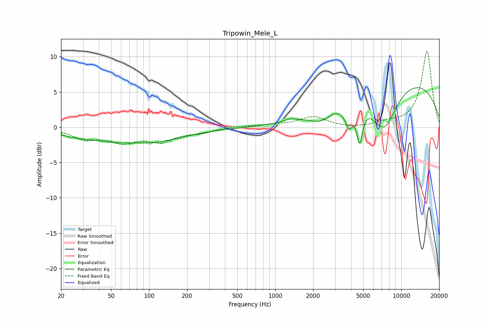

# Tripowin_Mele_L
See [usage instructions](https://github.com/jaakkopasanen/AutoEq#usage) for more options and info.

### Parametric EQs
Apply preamp of -5.7 dB when using parametric equalizer.

|   # | Type    |   Fc (Hz) |    Q |   Gain (dB) |
|-----|---------|-----------|------|-------------|
|   1 | Peaking |        25 | 1.17 |        -0.6 |
|   2 | Peaking |        78 | 1.38 |         0.4 |
|   3 | Peaking |        80 | 0.46 |        -2.5 |
|   4 | Peaking |      1308 | 2.98 |         0.4 |
|   5 | Peaking |      2274 | 1.76 |        -1.4 |
|   6 | Peaking |      3850 | 4.85 |        -2.8 |
|   7 | Peaking |      4164 | 4.2  |         0   |
|   8 | Peaking |      4686 | 6    |        -4.8 |
|   9 | Peaking |      7311 | 1.29 |        -6.4 |
|  10 | Peaking |      9816 | 0.25 |         7   |

### Fixed Band EQs
When using fixed band (also called graphic) equalizer, apply preamp of **-10.9 dB** (if available) and set gains manually with these parameters.

|   # | Type    |   Fc (Hz) |    Q |   Gain (dB) |
|-----|---------|-----------|------|-------------|
|   1 | Peaking |        31 | 1.41 |        -1.5 |
|   2 | Peaking |        62 | 1.41 |        -1.8 |
|   3 | Peaking |       125 | 1.41 |        -1.8 |
|   4 | Peaking |       250 | 1.41 |        -0.7 |
|   5 | Peaking |       500 | 1.41 |         0.2 |
|   6 | Peaking |      1000 | 1.41 |         0.3 |
|   7 | Peaking |      2000 | 1.41 |         1.5 |
|   8 | Peaking |      4000 | 1.41 |        -0.2 |
|   9 | Peaking |      8000 | 1.41 |         0.5 |
|  10 | Peaking |     16000 | 1.41 |        10.8 |

### Graphs

