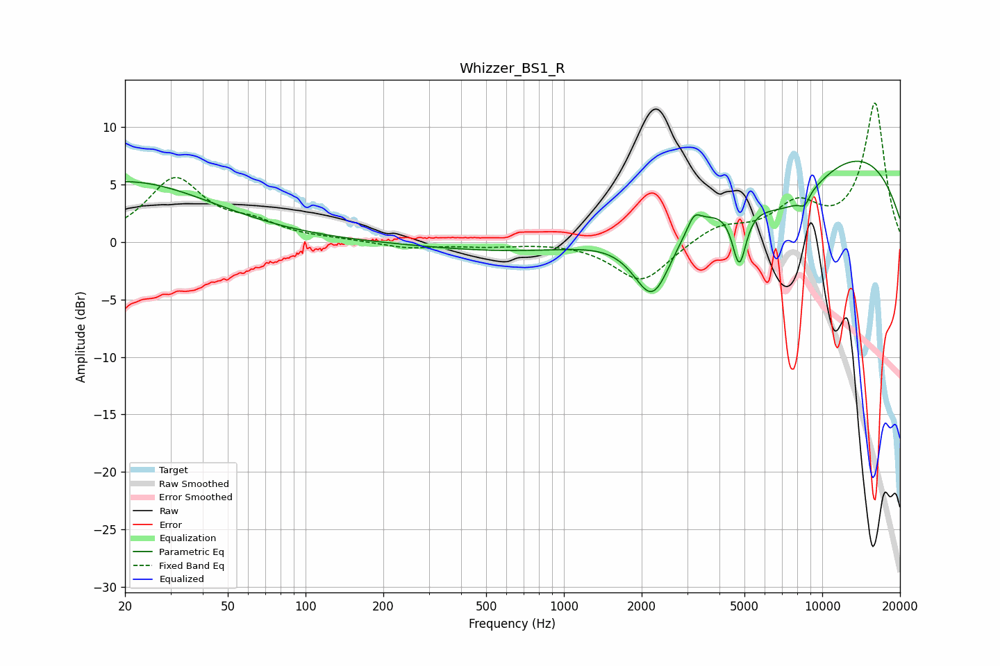

# Whizzer_BS1_R
See [usage instructions](https://github.com/jaakkopasanen/AutoEq#usage) for more options and info.

### Parametric EQs
Apply preamp of -7.1 dB when using parametric equalizer.

|   # | Type    |   Fc (Hz) |    Q |   Gain (dB) |
|-----|---------|-----------|------|-------------|
|   1 | Peaking |        20 | 0.42 |         5.3 |
|   2 | Peaking |      1869 | 0.18 |        -1.4 |
|   3 | Peaking |      2209 | 1.85 |        -6.5 |
|   4 | Peaking |      3193 | 5.68 |         1.3 |
|   5 | Peaking |      4775 | 5.18 |        -5   |
|   6 | Peaking |      7272 | 0.79 |        -4.9 |
|   7 | Peaking |      8685 | 5.15 |        -2.3 |
|   8 | Peaking |      8815 | 5.34 |         1.4 |
|   9 | Peaking |      9428 | 0.25 |        10.2 |
|  10 | Peaking |     10000 | 0.5  |        -0.6 |

### Fixed Band EQs
When using fixed band (also called graphic) equalizer, apply preamp of **-12.2 dB** (if available) and set gains manually with these parameters.

|   # | Type    |   Fc (Hz) |    Q |   Gain (dB) |
|-----|---------|-----------|------|-------------|
|   1 | Peaking |        31 | 1.41 |         5.4 |
|   2 | Peaking |        62 | 1.41 |         1.3 |
|   3 | Peaking |       125 | 1.41 |         0.2 |
|   4 | Peaking |       250 | 1.41 |        -0.5 |
|   5 | Peaking |       500 | 1.41 |        -0.3 |
|   6 | Peaking |      1000 | 1.41 |         0.1 |
|   7 | Peaking |      2000 | 1.41 |        -3.5 |
|   8 | Peaking |      4000 | 1.41 |         1.4 |
|   9 | Peaking |      8000 | 1.41 |         3   |
|  10 | Peaking |     16000 | 1.41 |        12   |

### Graphs

