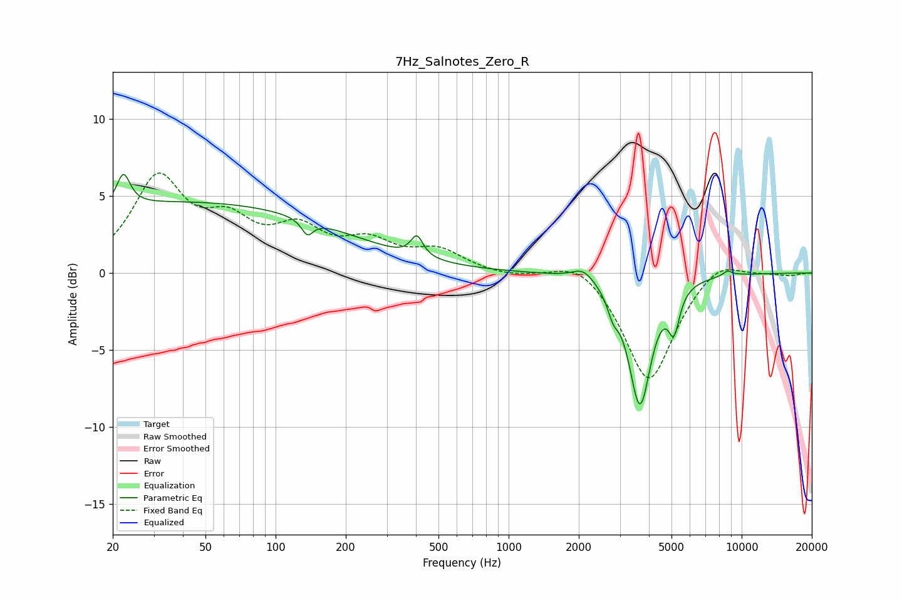

# 7Hz_Salnotes_Zero_R
See [usage instructions](https://github.com/jaakkopasanen/AutoEq#usage) for more options and info.

### Parametric EQs
Apply preamp of -6.5 dB when using parametric equalizer.

|   # | Type    |   Fc (Hz) |    Q |   Gain (dB) |
|-----|---------|-----------|------|-------------|
|   1 | Peaking |        22 | 5.09 |         2.1 |
|   2 | Peaking |        40 | 0.18 |         4.6 |
|   3 | Peaking |       137 | 5.67 |        -1   |
|   4 | Peaking |       404 | 5.56 |         1.3 |
|   5 | Peaking |      2093 | 3.07 |         0.8 |
|   6 | Peaking |      2809 | 5.98 |        -1.1 |
|   7 | Peaking |      3659 | 2.93 |        -8.4 |
|   8 | Peaking |      5124 | 5.92 |        -2.5 |
|   9 | Peaking |      8704 | 6    |         0.3 |
|  10 | Peaking |      9992 | 4.57 |         0   |

### Fixed Band EQs
When using fixed band (also called graphic) equalizer, apply preamp of **-6.6 dB** (if available) and set gains manually with these parameters.

|   # | Type    |   Fc (Hz) |    Q |   Gain (dB) |
|-----|---------|-----------|------|-------------|
|   1 | Peaking |        31 | 1.41 |         5.9 |
|   2 | Peaking |        62 | 1.41 |         2.6 |
|   3 | Peaking |       125 | 1.41 |         2.4 |
|   4 | Peaking |       250 | 1.41 |         1.7 |
|   5 | Peaking |       500 | 1.41 |         1.3 |
|   6 | Peaking |      1000 | 1.41 |        -0.3 |
|   7 | Peaking |      2000 | 1.41 |         1.1 |
|   8 | Peaking |      4000 | 1.41 |        -7.2 |
|   9 | Peaking |      8000 | 1.41 |         1.1 |
|  10 | Peaking |     16000 | 1.41 |        -0.2 |

### Graphs

