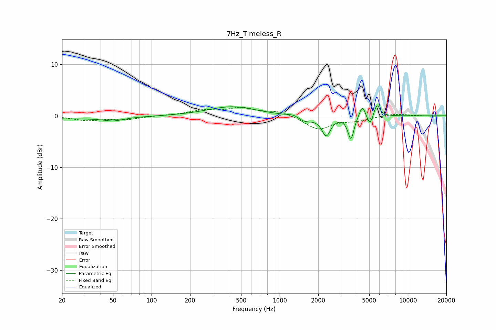

# 7Hz_Timeless_R
See [usage instructions](https://github.com/jaakkopasanen/AutoEq#usage) for more options and info.

### Parametric EQs
Apply preamp of -2.0 dB when using parametric equalizer.

|   # | Type    |   Fc (Hz) |    Q |   Gain (dB) |
|-----|---------|-----------|------|-------------|
|   1 | Peaking |        20 | 0.29 |        -0.6 |
|   2 | Peaking |        50 | 1.96 |        -0.6 |
|   3 | Peaking |       424 | 0.77 |         1.8 |
|   4 | Peaking |      1299 | 3.13 |         0.6 |
|   5 | Peaking |      1549 | 2.18 |        -1.2 |
|   6 | Peaking |      2308 | 4.2  |        -3.7 |
|   7 | Peaking |      3598 | 6    |        -4.5 |
|   8 | Peaking |      4425 | 5.8  |         2.5 |
|   9 | Peaking |      5059 | 5.89 |        -2.2 |
|  10 | Peaking |      5738 | 6    |         2.5 |

### Fixed Band EQs
When using fixed band (also called graphic) equalizer, apply preamp of **-1.7 dB** (if available) and set gains manually with these parameters.

|   # | Type    |   Fc (Hz) |    Q |   Gain (dB) |
|-----|---------|-----------|------|-------------|
|   1 | Peaking |        31 | 1.41 |        -0.9 |
|   2 | Peaking |        62 | 1.41 |        -0.7 |
|   3 | Peaking |       125 | 1.41 |         0   |
|   4 | Peaking |       250 | 1.41 |         0.9 |
|   5 | Peaking |       500 | 1.41 |         1.4 |
|   6 | Peaking |      1000 | 1.41 |         0.9 |
|   7 | Peaking |      2000 | 1.41 |        -2.6 |
|   8 | Peaking |      4000 | 1.41 |        -0.8 |
|   9 | Peaking |      8000 | 1.41 |         0.4 |
|  10 | Peaking |     16000 | 1.41 |        -0.1 |

### Graphs

