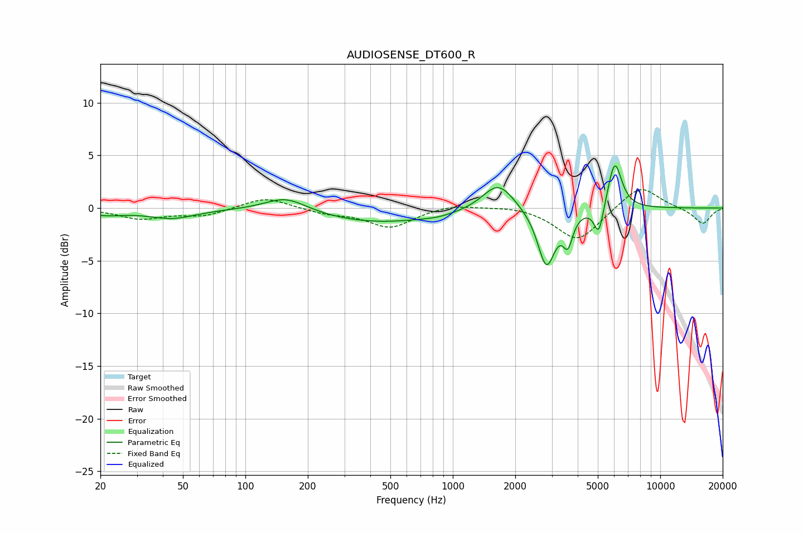

# AUDIOSENSE_DT600_R
See [usage instructions](https://github.com/jaakkopasanen/AutoEq#usage) for more options and info.

### Parametric EQs
Apply preamp of -4.1 dB when using parametric equalizer.

|   # | Type    |   Fc (Hz) |    Q |   Gain (dB) |
|-----|---------|-----------|------|-------------|
|   1 | Peaking |        21 | 1.46 |        -0.5 |
|   2 | Peaking |        44 | 1.22 |        -0.9 |
|   3 | Peaking |       157 | 1.36 |         1.4 |
|   4 | Peaking |       437 | 0.46 |        -1.4 |
|   5 | Peaking |       847 | 2.06 |        -0.2 |
|   6 | Peaking |      1656 | 1.87 |         2.7 |
|   7 | Peaking |      2826 | 3.33 |        -5.5 |
|   8 | Peaking |      3586 | 6    |        -2.6 |
|   9 | Peaking |      5060 | 6    |        -2.9 |
|  10 | Peaking |      6033 | 4.15 |         4.6 |

### Fixed Band EQs
When using fixed band (also called graphic) equalizer, apply preamp of **-1.8 dB** (if available) and set gains manually with these parameters.

|   # | Type    |   Fc (Hz) |    Q |   Gain (dB) |
|-----|---------|-----------|------|-------------|
|   1 | Peaking |        31 | 1.41 |        -1   |
|   2 | Peaking |        62 | 1.41 |        -0.7 |
|   3 | Peaking |       125 | 1.41 |         1.1 |
|   4 | Peaking |       250 | 1.41 |        -0.5 |
|   5 | Peaking |       500 | 1.41 |        -1.8 |
|   6 | Peaking |      1000 | 1.41 |         0.4 |
|   7 | Peaking |      2000 | 1.41 |         0.3 |
|   8 | Peaking |      4000 | 1.41 |        -3.2 |
|   9 | Peaking |      8000 | 1.41 |         2.3 |
|  10 | Peaking |     16000 | 1.41 |        -1.5 |

### Graphs

