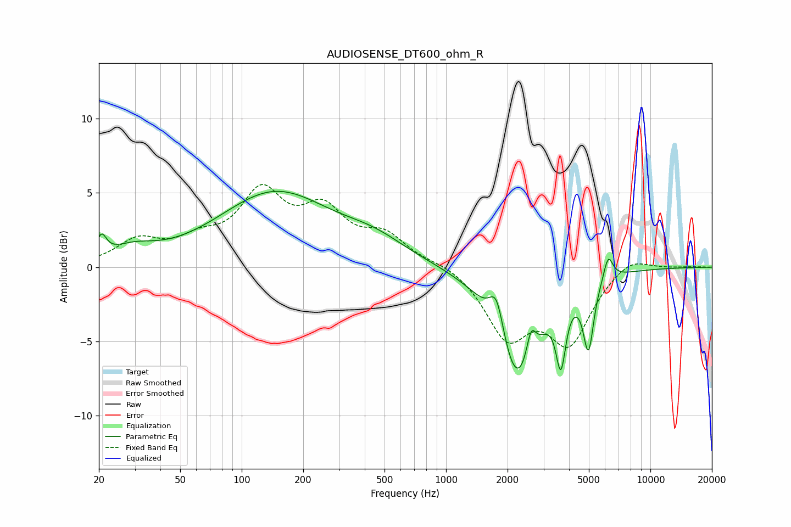

# AUDIOSENSE_DT600_ohm_R
See [usage instructions](https://github.com/jaakkopasanen/AutoEq#usage) for more options and info.

### Parametric EQs
Apply preamp of -5.2 dB when using parametric equalizer.

|   # | Type    |   Fc (Hz) |    Q |   Gain (dB) |
|-----|---------|-----------|------|-------------|
|   1 | Peaking |        21 | 5.9  |         1.4 |
|   2 | Peaking |        29 | 1.28 |         0.9 |
|   3 | Peaking |       145 | 0.51 |         4.9 |
|   4 | Peaking |       446 | 0.87 |         1.2 |
|   5 | Peaking |      1768 | 3.95 |         2.8 |
|   6 | Peaking |      2240 | 1.4  |        -7.9 |
|   7 | Peaking |      2606 | 6    |         2.1 |
|   8 | Peaking |      3647 | 6    |        -4.3 |
|   9 | Peaking |      4977 | 5.61 |        -4.5 |
|  10 | Peaking |      6217 | 6    |         1.7 |

### Fixed Band EQs
When using fixed band (also called graphic) equalizer, apply preamp of **-5.7 dB** (if available) and set gains manually with these parameters.

|   # | Type    |   Fc (Hz) |    Q |   Gain (dB) |
|-----|---------|-----------|------|-------------|
|   1 | Peaking |        31 | 1.41 |         1.6 |
|   2 | Peaking |        62 | 1.41 |         1.4 |
|   3 | Peaking |       125 | 1.41 |         4.6 |
|   4 | Peaking |       250 | 1.41 |         3.3 |
|   5 | Peaking |       500 | 1.41 |         1.9 |
|   6 | Peaking |      1000 | 1.41 |         0.4 |
|   7 | Peaking |      2000 | 1.41 |        -4.4 |
|   8 | Peaking |      4000 | 1.41 |        -4.8 |
|   9 | Peaking |      8000 | 1.41 |         0.9 |
|  10 | Peaking |     16000 | 1.41 |         0   |

### Graphs

