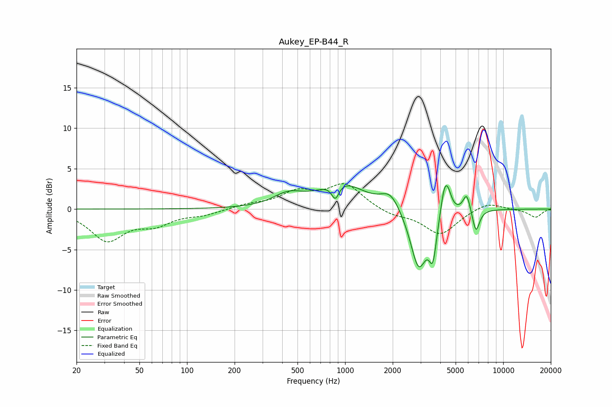

# Aukey_EP-B44_R
See [usage instructions](https://github.com/jaakkopasanen/AutoEq#usage) for more options and info.

### Parametric EQs
Apply preamp of -3.0 dB when using parametric equalizer.

|   # | Type    |   Fc (Hz) |    Q |   Gain (dB) |
|-----|---------|-----------|------|-------------|
|   1 | Peaking |       436 | 1.51 |         1.5 |
|   2 | Peaking |       867 | 6    |        -1.9 |
|   3 | Peaking |       954 | 1.03 |         3.2 |
|   4 | Peaking |      1938 | 2.38 |         2   |
|   5 | Peaking |      2919 | 2.64 |        -7.5 |
|   6 | Peaking |      3591 | 5.99 |        -4.6 |
|   7 | Peaking |      4249 | 5.6  |         3.4 |
|   8 | Peaking |      4490 | 6    |         1.6 |
|   9 | Peaking |      5877 | 6    |         2.3 |
|  10 | Peaking |      6722 | 6    |        -2.9 |

### Fixed Band EQs
When using fixed band (also called graphic) equalizer, apply preamp of **-3.2 dB** (if available) and set gains manually with these parameters.

|   # | Type    |   Fc (Hz) |    Q |   Gain (dB) |
|-----|---------|-----------|------|-------------|
|   1 | Peaking |        31 | 1.41 |        -3.7 |
|   2 | Peaking |        62 | 1.41 |        -1.6 |
|   3 | Peaking |       125 | 1.41 |        -0.6 |
|   4 | Peaking |       250 | 1.41 |         0.5 |
|   5 | Peaking |       500 | 1.41 |         1.9 |
|   6 | Peaking |      1000 | 1.41 |         3   |
|   7 | Peaking |      2000 | 1.41 |        -0.8 |
|   8 | Peaking |      4000 | 1.41 |        -3.1 |
|   9 | Peaking |      8000 | 1.41 |         0.9 |
|  10 | Peaking |     16000 | 1.41 |        -1   |

### Graphs

