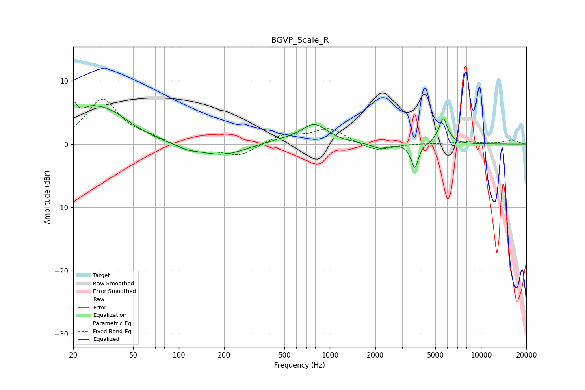

# BGVP_Scale_R
See [usage instructions](https://github.com/jaakkopasanen/AutoEq#usage) for more options and info.

### Parametric EQs
Apply preamp of -6.8 dB when using parametric equalizer.

|   # | Type    |   Fc (Hz) |    Q |   Gain (dB) |
|-----|---------|-----------|------|-------------|
|   1 | Peaking |        20 | 5.79 |         3.3 |
|   2 | Peaking |        25 | 2.24 |         1.6 |
|   3 | Peaking |        33 | 0.9  |         5   |
|   4 | Peaking |       113 | 1.59 |        -0.7 |
|   5 | Peaking |       195 | 0.98 |        -1.8 |
|   6 | Peaking |       458 | 1.36 |         0.5 |
|   7 | Peaking |       788 | 1.62 |         3.1 |
|   8 | Peaking |      2140 | 2.69 |        -0.8 |
|   9 | Peaking |      3645 | 6    |        -3.9 |
|  10 | Peaking |      5624 | 4.69 |         4.1 |

### Fixed Band EQs
When using fixed band (also called graphic) equalizer, apply preamp of **-7.2 dB** (if available) and set gains manually with these parameters.

|   # | Type    |   Fc (Hz) |    Q |   Gain (dB) |
|-----|---------|-----------|------|-------------|
|   1 | Peaking |        31 | 1.41 |         7   |
|   2 | Peaking |        62 | 1.41 |         0.8 |
|   3 | Peaking |       125 | 1.41 |        -1.3 |
|   4 | Peaking |       250 | 1.41 |        -1.8 |
|   5 | Peaking |       500 | 1.41 |         1.5 |
|   6 | Peaking |      1000 | 1.41 |         2.4 |
|   7 | Peaking |      2000 | 1.41 |        -1.2 |
|   8 | Peaking |      4000 | 1.41 |         0.1 |
|   9 | Peaking |      8000 | 1.41 |         0.3 |
|  10 | Peaking |     16000 | 1.41 |         0.7 |

### Graphs

