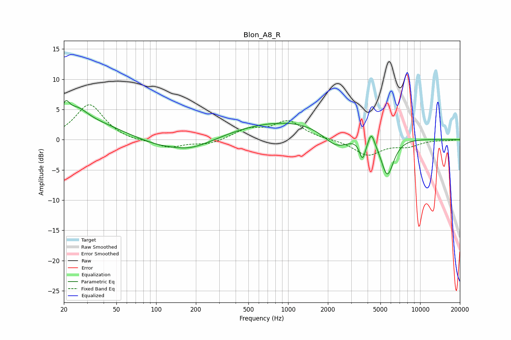

# Blon_A8_R
See [usage instructions](https://github.com/jaakkopasanen/AutoEq#usage) for more options and info.

### Parametric EQs
Apply preamp of -6.6 dB when using parametric equalizer.

|   # | Type    |   Fc (Hz) |    Q |   Gain (dB) |
|-----|---------|-----------|------|-------------|
|   1 | Peaking |        21 | 4.95 |         2.8 |
|   2 | Peaking |        25 | 1.67 |         3   |
|   3 | Peaking |        35 | 0.65 |         2.4 |
|   4 | Peaking |       136 | 1.55 |         0.4 |
|   5 | Peaking |       156 | 0.66 |        -2.7 |
|   6 | Peaking |      1169 | 0.28 |         3.3 |
|   7 | Peaking |      2331 | 1.3  |        -3.4 |
|   8 | Peaking |      3665 | 6    |        -3.3 |
|   9 | Peaking |      4276 | 6    |         2.1 |
|  10 | Peaking |      5640 | 2.77 |        -6.5 |

### Fixed Band EQs
When using fixed band (also called graphic) equalizer, apply preamp of **-5.9 dB** (if available) and set gains manually with these parameters.

|   # | Type    |   Fc (Hz) |    Q |   Gain (dB) |
|-----|---------|-----------|------|-------------|
|   1 | Peaking |        31 | 1.41 |         5.9 |
|   2 | Peaking |        62 | 1.41 |        -0.3 |
|   3 | Peaking |       125 | 1.41 |        -1.3 |
|   4 | Peaking |       250 | 1.41 |        -0.8 |
|   5 | Peaking |       500 | 1.41 |         1.6 |
|   6 | Peaking |      1000 | 1.41 |         3   |
|   7 | Peaking |      2000 | 1.41 |         0   |
|   8 | Peaking |      4000 | 1.41 |        -2.5 |
|   9 | Peaking |      8000 | 1.41 |        -1   |
|  10 | Peaking |     16000 | 1.41 |        -0.1 |

### Graphs

