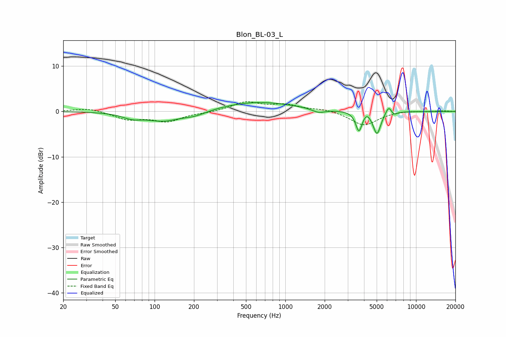

# Blon_BL-03_L
See [usage instructions](https://github.com/jaakkopasanen/AutoEq#usage) for more options and info.

### Parametric EQs
Apply preamp of -2.1 dB when using parametric equalizer.

|   # | Type    |   Fc (Hz) |    Q |   Gain (dB) |
|-----|---------|-----------|------|-------------|
|   1 | Peaking |        67 | 1.84 |        -1.1 |
|   2 | Peaking |       116 | 1.1  |        -2   |
|   3 | Peaking |       203 | 1.54 |        -1   |
|   4 | Peaking |       616 | 0.52 |         2.1 |
|   5 | Peaking |      1800 | 2.93 |        -0.9 |
|   6 | Peaking |      3654 | 5.94 |        -4.3 |
|   7 | Peaking |      4186 | 6    |         0.9 |
|   8 | Peaking |      5028 | 4.82 |        -5   |
|   9 | Peaking |      6177 | 6    |         1.8 |
|  10 | Peaking |      6782 | 6    |        -0.8 |

### Fixed Band EQs
When using fixed band (also called graphic) equalizer, apply preamp of **-2.2 dB** (if available) and set gains manually with these parameters.

|   # | Type    |   Fc (Hz) |    Q |   Gain (dB) |
|-----|---------|-----------|------|-------------|
|   1 | Peaking |        31 | 1.41 |         0.8 |
|   2 | Peaking |        62 | 1.41 |        -1.7 |
|   3 | Peaking |       125 | 1.41 |        -2.1 |
|   4 | Peaking |       250 | 1.41 |        -0.2 |
|   5 | Peaking |       500 | 1.41 |         2   |
|   6 | Peaking |      1000 | 1.41 |         1.3 |
|   7 | Peaking |      2000 | 1.41 |         0.5 |
|   8 | Peaking |      4000 | 1.41 |        -3.1 |
|   9 | Peaking |      8000 | 1.41 |         0.2 |
|  10 | Peaking |     16000 | 1.41 |         0.2 |

### Graphs

