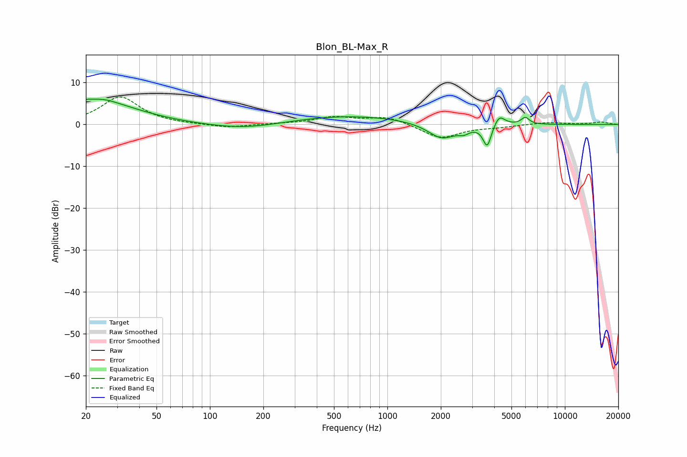

# Blon_BL-Max_R
See [usage instructions](https://github.com/jaakkopasanen/AutoEq#usage) for more options and info.

### Parametric EQs
Apply preamp of -6.1 dB when using parametric equalizer.

|   # | Type    |   Fc (Hz) |    Q |   Gain (dB) |
|-----|---------|-----------|------|-------------|
|   1 | Peaking |        20 | 5.68 |         0.7 |
|   2 | Peaking |        24 | 1.78 |         1.1 |
|   3 | Peaking |        25 | 0.64 |         4.8 |
|   4 | Peaking |       158 | 0.67 |        -1.5 |
|   5 | Peaking |       591 | 0.41 |         2.2 |
|   6 | Peaking |      2022 | 1.8  |        -3.8 |
|   7 | Peaking |      2694 | 4.4  |        -1.2 |
|   8 | Peaking |      3651 | 5.99 |        -5.3 |
|   9 | Peaking |      4265 | 4.57 |         2.7 |
|  10 | Peaking |      5984 | 6    |         1.7 |

### Fixed Band EQs
When using fixed band (also called graphic) equalizer, apply preamp of **-6.6 dB** (if available) and set gains manually with these parameters.

|   # | Type    |   Fc (Hz) |    Q |   Gain (dB) |
|-----|---------|-----------|------|-------------|
|   1 | Peaking |        31 | 1.41 |         6.6 |
|   2 | Peaking |        62 | 1.41 |        -0   |
|   3 | Peaking |       125 | 1.41 |        -0.8 |
|   4 | Peaking |       250 | 1.41 |         0.1 |
|   5 | Peaking |       500 | 1.41 |         1.7 |
|   6 | Peaking |      1000 | 1.41 |         1.8 |
|   7 | Peaking |      2000 | 1.41 |        -3.3 |
|   8 | Peaking |      4000 | 1.41 |        -0.5 |
|   9 | Peaking |      8000 | 1.41 |         0.5 |
|  10 | Peaking |     16000 | 1.41 |         0.6 |

### Graphs

