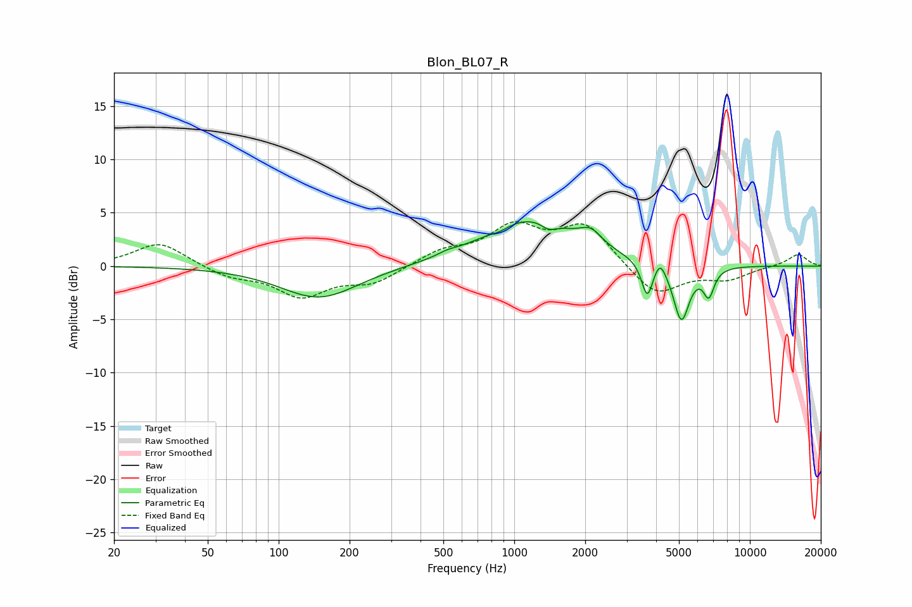

# Blon_BL07_R
See [usage instructions](https://github.com/jaakkopasanen/AutoEq#usage) for more options and info.

### Parametric EQs
Apply preamp of -4.2 dB when using parametric equalizer.

|   # | Type    |   Fc (Hz) |    Q |   Gain (dB) |
|-----|---------|-----------|------|-------------|
|   1 | Peaking |       149 | 0.86 |        -3   |
|   2 | Peaking |       520 | 3.84 |         0.2 |
|   3 | Peaking |       870 | 3.62 |        -0.3 |
|   4 | Peaking |      1161 | 0.72 |         4.4 |
|   5 | Peaking |      1400 | 4.43 |        -0.7 |
|   6 | Peaking |      2109 | 3.03 |         1.4 |
|   7 | Peaking |      3668 | 6    |        -3.3 |
|   8 | Peaking |      4160 | 6    |         1.3 |
|   9 | Peaking |      5120 | 4.11 |        -5.3 |
|  10 | Peaking |      6692 | 6    |        -2.5 |

### Fixed Band EQs
When using fixed band (also called graphic) equalizer, apply preamp of **-4.3 dB** (if available) and set gains manually with these parameters.

|   # | Type    |   Fc (Hz) |    Q |   Gain (dB) |
|-----|---------|-----------|------|-------------|
|   1 | Peaking |        31 | 1.41 |         2.3 |
|   2 | Peaking |        62 | 1.41 |        -1   |
|   3 | Peaking |       125 | 1.41 |        -2.7 |
|   4 | Peaking |       250 | 1.41 |        -1.5 |
|   5 | Peaking |       500 | 1.41 |         1.3 |
|   6 | Peaking |      1000 | 1.41 |         3.4 |
|   7 | Peaking |      2000 | 1.41 |         3.8 |
|   8 | Peaking |      4000 | 1.41 |        -2.9 |
|   9 | Peaking |      8000 | 1.41 |        -1.1 |
|  10 | Peaking |     16000 | 1.41 |         1.1 |

### Graphs

