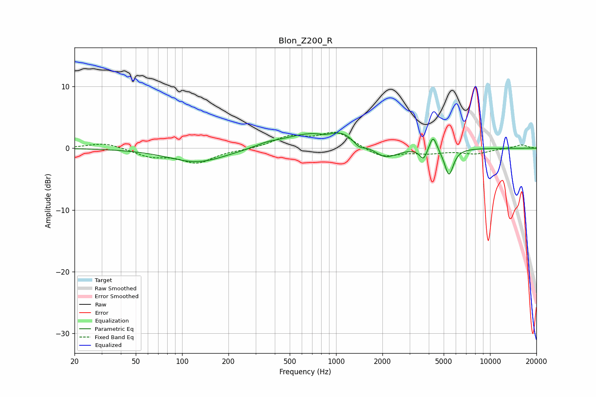

# Blon_Z200_R
See [usage instructions](https://github.com/jaakkopasanen/AutoEq#usage) for more options and info.

### Parametric EQs
Apply preamp of -2.6 dB when using parametric equalizer.

|   # | Type    |   Fc (Hz) |    Q |   Gain (dB) |
|-----|---------|-----------|------|-------------|
|   1 | Peaking |       125 | 0.77 |        -2.3 |
|   2 | Peaking |       355 | 1.9  |         0.5 |
|   3 | Peaking |       610 | 0.87 |         1.4 |
|   4 | Peaking |       861 | 2.63 |        -0.7 |
|   5 | Peaking |      1083 | 0.93 |         2.6 |
|   6 | Peaking |      1410 | 3.43 |        -1.4 |
|   7 | Peaking |      2076 | 1.74 |        -2.2 |
|   8 | Peaking |      3695 | 6    |        -1.8 |
|   9 | Peaking |      4264 | 5.99 |         2.5 |
|  10 | Peaking |      5409 | 4.9  |        -4.4 |

### Fixed Band EQs
When using fixed band (also called graphic) equalizer, apply preamp of **-2.7 dB** (if available) and set gains manually with these parameters.

|   # | Type    |   Fc (Hz) |    Q |   Gain (dB) |
|-----|---------|-----------|------|-------------|
|   1 | Peaking |        31 | 1.41 |         0.9 |
|   2 | Peaking |        62 | 1.41 |        -1.2 |
|   3 | Peaking |       125 | 1.41 |        -2.3 |
|   4 | Peaking |       250 | 1.41 |        -0.2 |
|   5 | Peaking |       500 | 1.41 |         1.8 |
|   6 | Peaking |      1000 | 1.41 |         2.6 |
|   7 | Peaking |      2000 | 1.41 |        -1.6 |
|   8 | Peaking |      4000 | 1.41 |        -0.7 |
|   9 | Peaking |      8000 | 1.41 |        -0.8 |
|  10 | Peaking |     16000 | 1.41 |         0.6 |

### Graphs

