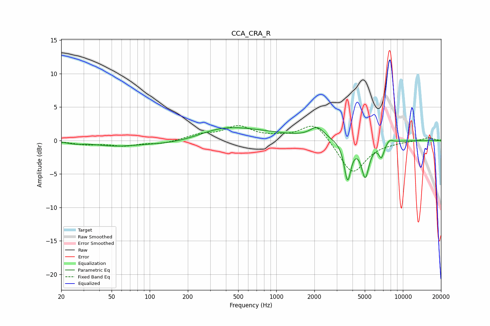

# CCA_CRA_R
See [usage instructions](https://github.com/jaakkopasanen/AutoEq#usage) for more options and info.

### Parametric EQs
Apply preamp of -2.0 dB when using parametric equalizer.

|   # | Type    |   Fc (Hz) |    Q |   Gain (dB) |
|-----|---------|-----------|------|-------------|
|   1 | Peaking |        26 | 2.6  |        -0.3 |
|   2 | Peaking |        53 | 0.81 |        -0.7 |
|   3 | Peaking |       173 | 0.55 |        -1.4 |
|   4 | Peaking |       367 | 0.86 |         0.6 |
|   5 | Peaking |       397 | 0.35 |         1.9 |
|   6 | Peaking |      2101 | 2.51 |         1.7 |
|   7 | Peaking |      3658 | 5.25 |        -5.7 |
|   8 | Peaking |      5046 | 4.57 |        -5.2 |
|   9 | Peaking |      6763 | 6    |        -2.1 |
|  10 | Peaking |      7851 | 5.25 |         0.6 |

### Fixed Band EQs
When using fixed band (also called graphic) equalizer, apply preamp of **-2.3 dB** (if available) and set gains manually with these parameters.

|   # | Type    |   Fc (Hz) |    Q |   Gain (dB) |
|-----|---------|-----------|------|-------------|
|   1 | Peaking |        31 | 1.41 |        -0.5 |
|   2 | Peaking |        62 | 1.41 |        -0.7 |
|   3 | Peaking |       125 | 1.41 |        -0.5 |
|   4 | Peaking |       250 | 1.41 |         0.8 |
|   5 | Peaking |       500 | 1.41 |         2   |
|   6 | Peaking |      1000 | 1.41 |         0.3 |
|   7 | Peaking |      2000 | 1.41 |         2.8 |
|   8 | Peaking |      4000 | 1.41 |        -5.1 |
|   9 | Peaking |      8000 | 1.41 |        -0.2 |
|  10 | Peaking |     16000 | 1.41 |         0.5 |

### Graphs

