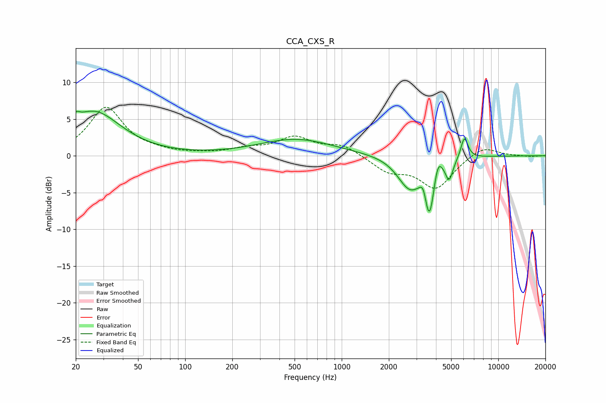

# CCA_CXS_R
See [usage instructions](https://github.com/jaakkopasanen/AutoEq#usage) for more options and info.

### Parametric EQs
Apply preamp of -6.2 dB when using parametric equalizer.

|   # | Type    |   Fc (Hz) |    Q |   Gain (dB) |
|-----|---------|-----------|------|-------------|
|   1 | Peaking |        20 | 5.97 |         1   |
|   2 | Peaking |        26 | 0.83 |         6   |
|   3 | Peaking |       510 | 0.59 |         2.3 |
|   4 | Peaking |      2490 | 1.81 |        -1.4 |
|   5 | Peaking |      2739 | 2.28 |        -2.6 |
|   6 | Peaking |      3333 | 6    |         2.4 |
|   7 | Peaking |      3622 | 3.82 |        -8.6 |
|   8 | Peaking |      4096 | 4.9  |         3.2 |
|   9 | Peaking |      4858 | 5.98 |        -2.6 |
|  10 | Peaking |      6077 | 6    |         3   |

### Fixed Band EQs
When using fixed band (also called graphic) equalizer, apply preamp of **-6.7 dB** (if available) and set gains manually with these parameters.

|   # | Type    |   Fc (Hz) |    Q |   Gain (dB) |
|-----|---------|-----------|------|-------------|
|   1 | Peaking |        31 | 1.41 |         6.5 |
|   2 | Peaking |        62 | 1.41 |         0.4 |
|   3 | Peaking |       125 | 1.41 |         0.1 |
|   4 | Peaking |       250 | 1.41 |         0.8 |
|   5 | Peaking |       500 | 1.41 |         2.4 |
|   6 | Peaking |      1000 | 1.41 |         1.4 |
|   7 | Peaking |      2000 | 1.41 |        -2   |
|   8 | Peaking |      4000 | 1.41 |        -4.3 |
|   9 | Peaking |      8000 | 1.41 |         1.5 |
|  10 | Peaking |     16000 | 1.41 |        -0.1 |

### Graphs

