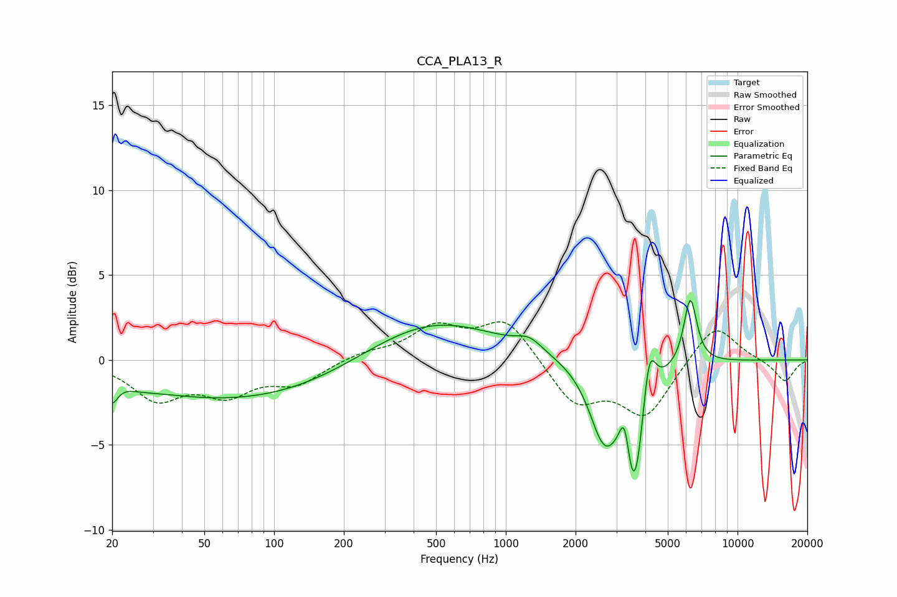

# CCA_PLA13_R
See [usage instructions](https://github.com/jaakkopasanen/AutoEq#usage) for more options and info.

### Parametric EQs
Apply preamp of -3.6 dB when using parametric equalizer.

|   # | Type    |   Fc (Hz) |    Q |   Gain (dB) |
|-----|---------|-----------|------|-------------|
|   1 | Peaking |        20 | 5.99 |        -1.2 |
|   2 | Peaking |        26 | 1.69 |        -0.2 |
|   3 | Peaking |        72 | 0.3  |        -2.4 |
|   4 | Peaking |       474 | 0.49 |         2.5 |
|   5 | Peaking |      1262 | 2.54 |         0.7 |
|   6 | Peaking |      2647 | 2.24 |        -4.1 |
|   7 | Peaking |      3259 | 6    |         3   |
|   8 | Peaking |      3572 | 3    |        -8   |
|   9 | Peaking |      4144 | 4.77 |         3.9 |
|  10 | Peaking |      6254 | 4.86 |         4   |

### Fixed Band EQs
When using fixed band (also called graphic) equalizer, apply preamp of **-2.3 dB** (if available) and set gains manually with these parameters.

|   # | Type    |   Fc (Hz) |    Q |   Gain (dB) |
|-----|---------|-----------|------|-------------|
|   1 | Peaking |        31 | 1.41 |        -2.2 |
|   2 | Peaking |        62 | 1.41 |        -1.8 |
|   3 | Peaking |       125 | 1.41 |        -1.3 |
|   4 | Peaking |       250 | 1.41 |         0.4 |
|   5 | Peaking |       500 | 1.41 |         1.8 |
|   6 | Peaking |      1000 | 1.41 |         2.4 |
|   7 | Peaking |      2000 | 1.41 |        -2.6 |
|   8 | Peaking |      4000 | 1.41 |        -3.2 |
|   9 | Peaking |      8000 | 1.41 |         2.3 |
|  10 | Peaking |     16000 | 1.41 |        -1.3 |

### Graphs

