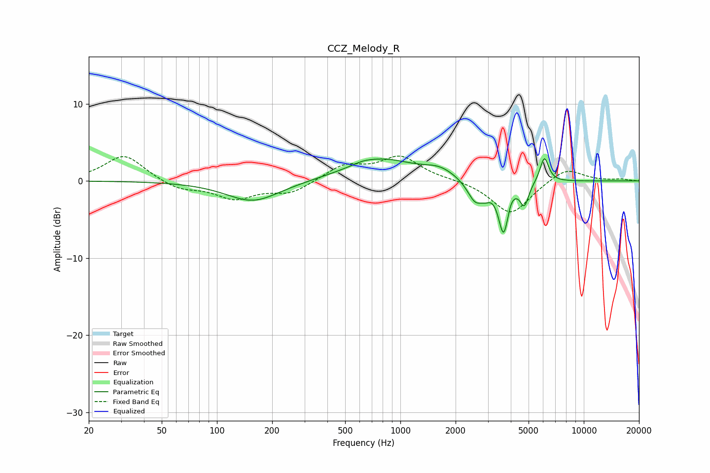

# CCZ_Melody_R
See [usage instructions](https://github.com/jaakkopasanen/AutoEq#usage) for more options and info.

### Parametric EQs
Apply preamp of -3.0 dB when using parametric equalizer.

|   # | Type    |   Fc (Hz) |    Q |   Gain (dB) |
|-----|---------|-----------|------|-------------|
|   1 | Peaking |       157 | 0.97 |        -2.7 |
|   2 | Peaking |       625 | 3.21 |         0.2 |
|   3 | Peaking |       778 | 0.77 |         2.8 |
|   4 | Peaking |      1639 | 1.68 |         1.1 |
|   5 | Peaking |      2568 | 3.17 |        -2.8 |
|   6 | Peaking |      2927 | 6    |        -0.7 |
|   7 | Peaking |      3660 | 4.98 |        -6.8 |
|   8 | Peaking |      3959 | 5.49 |         0.9 |
|   9 | Peaking |      4744 | 5.87 |        -2.8 |
|  10 | Peaking |      6095 | 5.89 |         3.3 |

### Fixed Band EQs
When using fixed band (also called graphic) equalizer, apply preamp of **-3.3 dB** (if available) and set gains manually with these parameters.

|   # | Type    |   Fc (Hz) |    Q |   Gain (dB) |
|-----|---------|-----------|------|-------------|
|   1 | Peaking |        31 | 1.41 |         3.4 |
|   2 | Peaking |        62 | 1.41 |        -1.1 |
|   3 | Peaking |       125 | 1.41 |        -2.2 |
|   4 | Peaking |       250 | 1.41 |        -1.5 |
|   5 | Peaking |       500 | 1.41 |         2   |
|   6 | Peaking |      1000 | 1.41 |         3   |
|   7 | Peaking |      2000 | 1.41 |         0.2 |
|   8 | Peaking |      4000 | 1.41 |        -4.4 |
|   9 | Peaking |      8000 | 1.41 |         1.8 |
|  10 | Peaking |     16000 | 1.41 |         0.2 |

### Graphs

