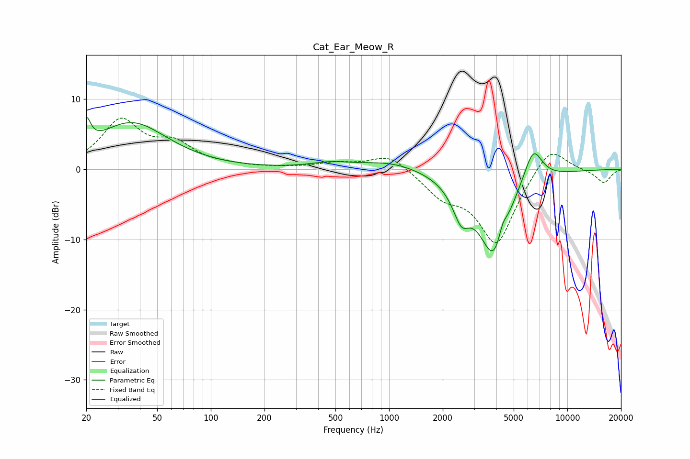

# Cat_Ear_Meow_R
See [usage instructions](https://github.com/jaakkopasanen/AutoEq#usage) for more options and info.

### Parametric EQs
Apply preamp of -7.5 dB when using parametric equalizer.

|   # | Type    |   Fc (Hz) |    Q |   Gain (dB) |
|-----|---------|-----------|------|-------------|
|   1 | Peaking |        20 | 5.95 |         3.7 |
|   2 | Peaking |        36 | 0.7  |         6.6 |
|   3 | Peaking |       470 | 1.25 |         0.7 |
|   4 | Peaking |      1035 | 0.86 |         1.2 |
|   5 | Peaking |      2416 | 2.18 |        -0.8 |
|   6 | Peaking |      2549 | 3.31 |        -3.4 |
|   7 | Peaking |      3873 | 1.53 |       -12.4 |
|   8 | Peaking |      4334 | 5.98 |         1.9 |
|   9 | Peaking |      5262 | 2.16 |         0.6 |
|  10 | Peaking |      6433 | 2.62 |         5.1 |

### Fixed Band EQs
When using fixed band (also called graphic) equalizer, apply preamp of **-7.4 dB** (if available) and set gains manually with these parameters.

|   # | Type    |   Fc (Hz) |    Q |   Gain (dB) |
|-----|---------|-----------|------|-------------|
|   1 | Peaking |        31 | 1.41 |         6.7 |
|   2 | Peaking |        62 | 1.41 |         3.1 |
|   3 | Peaking |       125 | 1.41 |         0.3 |
|   4 | Peaking |       250 | 1.41 |         0.1 |
|   5 | Peaking |       500 | 1.41 |         0.8 |
|   6 | Peaking |      1000 | 1.41 |         2.3 |
|   7 | Peaking |      2000 | 1.41 |        -3.1 |
|   8 | Peaking |      4000 | 1.41 |       -10.5 |
|   9 | Peaking |      8000 | 1.41 |         3.9 |
|  10 | Peaking |     16000 | 1.41 |        -2   |

### Graphs

