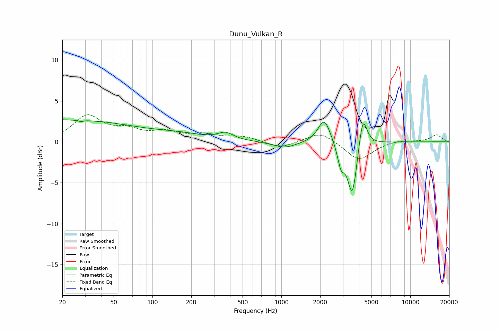

# Dunu_Vulkan_R
See [usage instructions](https://github.com/jaakkopasanen/AutoEq#usage) for more options and info.

### Parametric EQs
Apply preamp of -2.8 dB when using parametric equalizer.

|   # | Type    |   Fc (Hz) |    Q |   Gain (dB) |
|-----|---------|-----------|------|-------------|
|   1 | Peaking |        20 | 0.23 |         2.7 |
|   2 | Peaking |        29 | 5.94 |        -2.4 |
|   3 | Peaking |        29 | 5.98 |         2.2 |
|   4 | Peaking |       164 | 0.76 |         0.6 |
|   5 | Peaking |       370 | 2.37 |         0.9 |
|   6 | Peaking |      1062 | 1.57 |        -0.8 |
|   7 | Peaking |      2152 | 2.93 |         3   |
|   8 | Peaking |      2900 | 5.16 |        -2.5 |
|   9 | Peaking |      3553 | 3.77 |        -6.8 |
|  10 | Peaking |      4281 | 4.48 |         4.2 |

### Fixed Band EQs
When using fixed band (also called graphic) equalizer, apply preamp of **-3.4 dB** (if available) and set gains manually with these parameters.

|   # | Type    |   Fc (Hz) |    Q |   Gain (dB) |
|-----|---------|-----------|------|-------------|
|   1 | Peaking |        31 | 1.41 |         3   |
|   2 | Peaking |        62 | 1.41 |         1.2 |
|   3 | Peaking |       125 | 1.41 |         1   |
|   4 | Peaking |       250 | 1.41 |         0.8 |
|   5 | Peaking |       500 | 1.41 |         0.6 |
|   6 | Peaking |      1000 | 1.41 |        -0.8 |
|   7 | Peaking |      2000 | 1.41 |         1.3 |
|   8 | Peaking |      4000 | 1.41 |        -2.3 |
|   9 | Peaking |      8000 | 1.41 |         0.2 |
|  10 | Peaking |     16000 | 1.41 |         0.9 |

### Graphs

