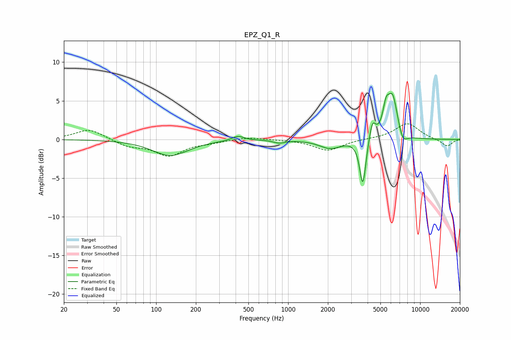

# EPZ_Q1_R
See [usage instructions](https://github.com/jaakkopasanen/AutoEq#usage) for more options and info.

### Parametric EQs
Apply preamp of -6.1 dB when using parametric equalizer.

|   # | Type    |   Fc (Hz) |    Q |   Gain (dB) |
|-----|---------|-----------|------|-------------|
|   1 | Peaking |       128 | 1.05 |        -2.1 |
|   2 | Peaking |       417 | 3.06 |         0.6 |
|   3 | Peaking |       857 | 3.34 |        -0.4 |
|   4 | Peaking |      2087 | 1.73 |        -1.1 |
|   5 | Peaking |      3677 | 6    |        -6.1 |
|   6 | Peaking |      4348 | 5.91 |         2.4 |
|   7 | Peaking |      5511 | 5.73 |         2.8 |
|   8 | Peaking |      6183 | 3.57 |         5.4 |
|   9 | Peaking |      7361 | 4.46 |        -1.1 |
|  10 | Peaking |      7517 | 3.42 |        -0.4 |

### Fixed Band EQs
When using fixed band (also called graphic) equalizer, apply preamp of **-2.1 dB** (if available) and set gains manually with these parameters.

|   # | Type    |   Fc (Hz) |    Q |   Gain (dB) |
|-----|---------|-----------|------|-------------|
|   1 | Peaking |        31 | 1.41 |         1.4 |
|   2 | Peaking |        62 | 1.41 |        -0.8 |
|   3 | Peaking |       125 | 1.41 |        -2   |
|   4 | Peaking |       250 | 1.41 |        -0.3 |
|   5 | Peaking |       500 | 1.41 |         0.3 |
|   6 | Peaking |      1000 | 1.41 |        -0   |
|   7 | Peaking |      2000 | 1.41 |        -1.4 |
|   8 | Peaking |      4000 | 1.41 |         0.1 |
|   9 | Peaking |      8000 | 1.41 |         2.1 |
|  10 | Peaking |     16000 | 1.41 |        -0.9 |

### Graphs

