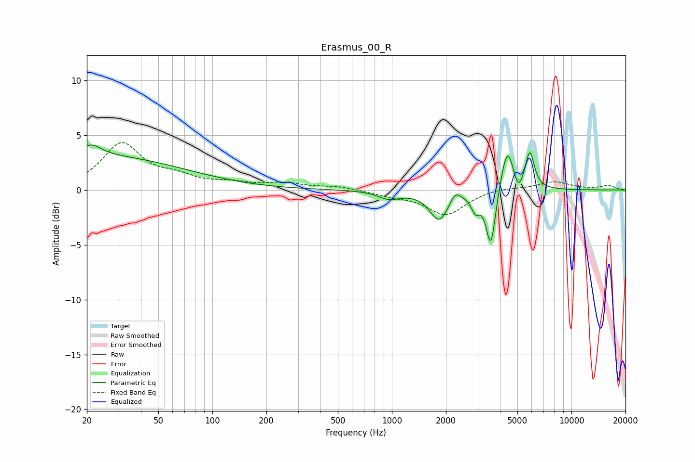

# Erasmus_00_R
See [usage instructions](https://github.com/jaakkopasanen/AutoEq#usage) for more options and info.

### Parametric EQs
Apply preamp of -4.2 dB when using parametric equalizer.

|   # | Type    |   Fc (Hz) |    Q |   Gain (dB) |
|-----|---------|-----------|------|-------------|
|   1 | Peaking |        20 | 0.25 |         3.1 |
|   2 | Peaking |        21 | 2.73 |         1   |
|   3 | Peaking |       964 | 2.35 |        -0.7 |
|   4 | Peaking |      1838 | 2.64 |        -2.7 |
|   5 | Peaking |      2245 | 4.83 |         1   |
|   6 | Peaking |      2922 | 5.99 |        -1.4 |
|   7 | Peaking |      3557 | 5.39 |        -5.3 |
|   8 | Peaking |      4394 | 3.94 |         4.1 |
|   9 | Peaking |      5051 | 6    |        -1.3 |
|  10 | Peaking |      5867 | 5.76 |         3.3 |

### Fixed Band EQs
When using fixed band (also called graphic) equalizer, apply preamp of **-4.4 dB** (if available) and set gains manually with these parameters.

|   # | Type    |   Fc (Hz) |    Q |   Gain (dB) |
|-----|---------|-----------|------|-------------|
|   1 | Peaking |        31 | 1.41 |         4.1 |
|   2 | Peaking |        62 | 1.41 |         1   |
|   3 | Peaking |       125 | 1.41 |         0.5 |
|   4 | Peaking |       250 | 1.41 |         0.5 |
|   5 | Peaking |       500 | 1.41 |         0.3 |
|   6 | Peaking |      1000 | 1.41 |        -0.4 |
|   7 | Peaking |      2000 | 1.41 |        -2.2 |
|   8 | Peaking |      4000 | 1.41 |         0.3 |
|   9 | Peaking |      8000 | 1.41 |         0.7 |
|  10 | Peaking |     16000 | 1.41 |         0.4 |

### Graphs

