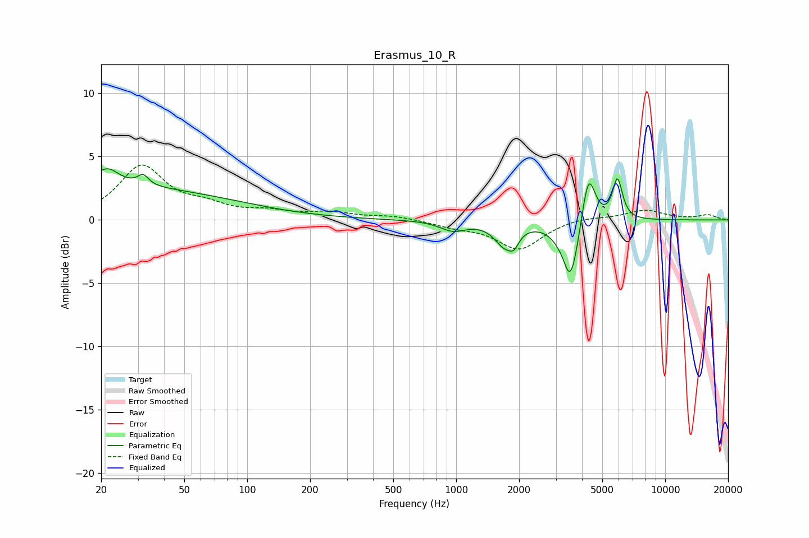

# Erasmus_10_R
See [usage instructions](https://github.com/jaakkopasanen/AutoEq#usage) for more options and info.

### Parametric EQs
Apply preamp of -4.1 dB when using parametric equalizer.

|   # | Type    |   Fc (Hz) |    Q |   Gain (dB) |
|-----|---------|-----------|------|-------------|
|   1 | Peaking |        21 | 0.22 |         2.6 |
|   2 | Peaking |        21 | 2.5  |         1.4 |
|   3 | Peaking |        32 | 5.5  |         0.8 |
|   4 | Peaking |       964 | 2.31 |        -0.8 |
|   5 | Peaking |      1702 | 2.96 |        -1.7 |
|   6 | Peaking |      1890 | 6    |        -0.9 |
|   7 | Peaking |      3288 | 5.11 |         0.7 |
|   8 | Peaking |      3498 | 3.31 |        -5.6 |
|   9 | Peaking |      4289 | 4.29 |         4.4 |
|  10 | Peaking |      5911 | 6    |         3.2 |

### Fixed Band EQs
When using fixed band (also called graphic) equalizer, apply preamp of **-4.4 dB** (if available) and set gains manually with these parameters.

|   # | Type    |   Fc (Hz) |    Q |   Gain (dB) |
|-----|---------|-----------|------|-------------|
|   1 | Peaking |        31 | 1.41 |         4.1 |
|   2 | Peaking |        62 | 1.41 |         0.9 |
|   3 | Peaking |       125 | 1.41 |         0.5 |
|   4 | Peaking |       250 | 1.41 |         0.5 |
|   5 | Peaking |       500 | 1.41 |         0.3 |
|   6 | Peaking |      1000 | 1.41 |        -0.5 |
|   7 | Peaking |      2000 | 1.41 |        -2.3 |
|   8 | Peaking |      4000 | 1.41 |         0.3 |
|   9 | Peaking |      8000 | 1.41 |         0.8 |
|  10 | Peaking |     16000 | 1.41 |         0.4 |

### Graphs

