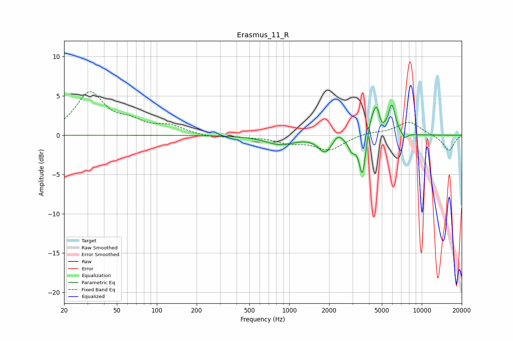

# Erasmus_11_R
See [usage instructions](https://github.com/jaakkopasanen/AutoEq#usage) for more options and info.

### Parametric EQs
Apply preamp of -3.9 dB when using parametric equalizer.

|   # | Type    |   Fc (Hz) |    Q |   Gain (dB) |
|-----|---------|-----------|------|-------------|
|   1 | Peaking |       852 | 1.26 |        -1.1 |
|   2 | Peaking |      1869 | 2.85 |        -2   |
|   3 | Peaking |      2331 | 4.09 |         0.9 |
|   4 | Peaking |      2976 | 4.88 |        -1.5 |
|   5 | Peaking |      3561 | 5.92 |        -5.2 |
|   6 | Peaking |      4105 | 6    |         1.3 |
|   7 | Peaking |      4557 | 4.54 |         3.9 |
|   8 | Peaking |      4915 | 6    |        -1   |
|   9 | Peaking |      5944 | 5.26 |         3.7 |
|  10 | Peaking |      7426 | 6    |        -0.7 |

### Fixed Band EQs
When using fixed band (also called graphic) equalizer, apply preamp of **-5.6 dB** (if available) and set gains manually with these parameters.

|   # | Type    |   Fc (Hz) |    Q |   Gain (dB) |
|-----|---------|-----------|------|-------------|
|   1 | Peaking |        31 | 1.41 |         5.3 |
|   2 | Peaking |        62 | 1.41 |         1.3 |
|   3 | Peaking |       125 | 1.41 |         1   |
|   4 | Peaking |       250 | 1.41 |        -0.3 |
|   5 | Peaking |       500 | 1.41 |        -0.1 |
|   6 | Peaking |      1000 | 1.41 |        -0.8 |
|   7 | Peaking |      2000 | 1.41 |        -1.8 |
|   8 | Peaking |      4000 | 1.41 |         0.4 |
|   9 | Peaking |      8000 | 1.41 |         1.7 |
|  10 | Peaking |     16000 | 1.41 |        -2   |

### Graphs

