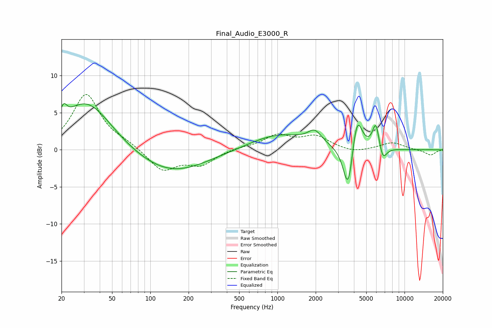

# Final_Audio_E3000_R
See [usage instructions](https://github.com/jaakkopasanen/AutoEq#usage) for more options and info.

### Parametric EQs
Apply preamp of -6.3 dB when using parametric equalizer.

|   # | Type    |   Fc (Hz) |    Q |   Gain (dB) |
|-----|---------|-----------|------|-------------|
|   1 | Peaking |        21 | 5.74 |         1.7 |
|   2 | Peaking |        31 | 0.76 |         5.2 |
|   3 | Peaking |        33 | 0.65 |         1.4 |
|   4 | Peaking |       143 | 0.5  |        -3.2 |
|   5 | Peaking |      1028 | 0.61 |         2.1 |
|   6 | Peaking |      1964 | 2.69 |         1.6 |
|   7 | Peaking |      3603 | 3.63 |        -6.7 |
|   8 | Peaking |      4224 | 3.51 |         5.3 |
|   9 | Peaking |      5957 | 5.1  |         3.6 |
|  10 | Peaking |      6728 | 4.46 |        -2.1 |

### Fixed Band EQs
When using fixed band (also called graphic) equalizer, apply preamp of **-7.6 dB** (if available) and set gains manually with these parameters.

|   # | Type    |   Fc (Hz) |    Q |   Gain (dB) |
|-----|---------|-----------|------|-------------|
|   1 | Peaking |        31 | 1.41 |         7.4 |
|   2 | Peaking |        62 | 1.41 |         0.7 |
|   3 | Peaking |       125 | 1.41 |        -2.8 |
|   4 | Peaking |       250 | 1.41 |        -1.9 |
|   5 | Peaking |       500 | 1.41 |         0.3 |
|   6 | Peaking |      1000 | 1.41 |         1.9 |
|   7 | Peaking |      2000 | 1.41 |         1.7 |
|   8 | Peaking |      4000 | 1.41 |        -0.5 |
|   9 | Peaking |      8000 | 1.41 |         1   |
|  10 | Peaking |     16000 | 1.41 |        -0.7 |

### Graphs

