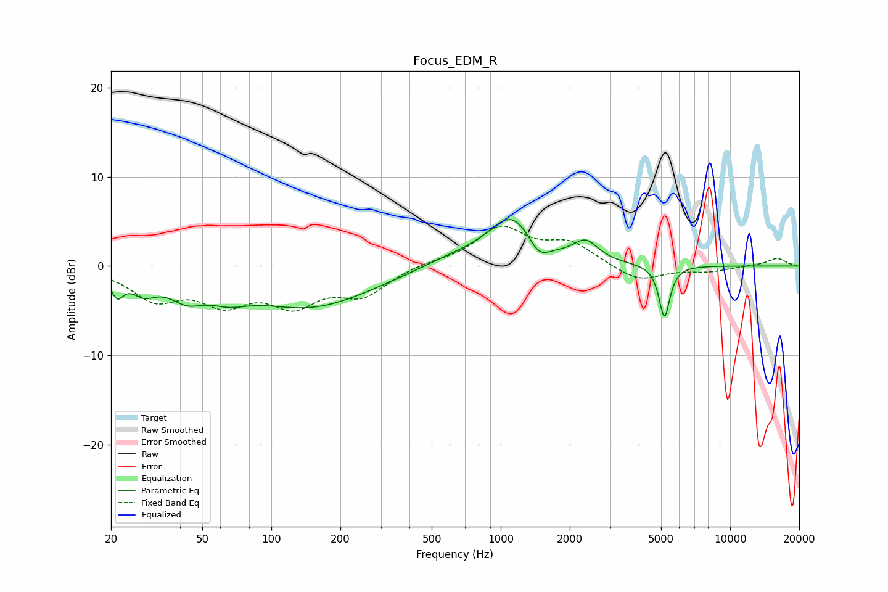

# Focus_EDM_R
See [usage instructions](https://github.com/jaakkopasanen/AutoEq#usage) for more options and info.

### Parametric EQs
Apply preamp of -5.3 dB when using parametric equalizer.

|   # | Type    |   Fc (Hz) |    Q |   Gain (dB) |
|-----|---------|-----------|------|-------------|
|   1 | Peaking |        21 | 5.28 |        -2.3 |
|   2 | Peaking |        28 | 2.54 |        -2   |
|   3 | Peaking |        43 | 1.85 |        -2.3 |
|   4 | Peaking |        65 | 1.62 |        -1.5 |
|   5 | Peaking |       148 | 0.52 |        -4.5 |
|   6 | Peaking |       621 | 0.9  |         1   |
|   7 | Peaking |      1127 | 1.36 |         5.5 |
|   8 | Peaking |      1463 | 2.95 |        -2.2 |
|   9 | Peaking |      2348 | 2.61 |         2.2 |
|  10 | Peaking |      5171 | 6    |        -5.9 |

### Fixed Band EQs
When using fixed band (also called graphic) equalizer, apply preamp of **-4.6 dB** (if available) and set gains manually with these parameters.

|   # | Type    |   Fc (Hz) |    Q |   Gain (dB) |
|-----|---------|-----------|------|-------------|
|   1 | Peaking |        31 | 1.41 |        -3.4 |
|   2 | Peaking |        62 | 1.41 |        -3.5 |
|   3 | Peaking |       125 | 1.41 |        -3.8 |
|   4 | Peaking |       250 | 1.41 |        -3   |
|   5 | Peaking |       500 | 1.41 |         0.4 |
|   6 | Peaking |      1000 | 1.41 |         4.2 |
|   7 | Peaking |      2000 | 1.41 |         2.4 |
|   8 | Peaking |      4000 | 1.41 |        -1.8 |
|   9 | Peaking |      8000 | 1.41 |        -0.6 |
|  10 | Peaking |     16000 | 1.41 |         0.9 |

### Graphs

